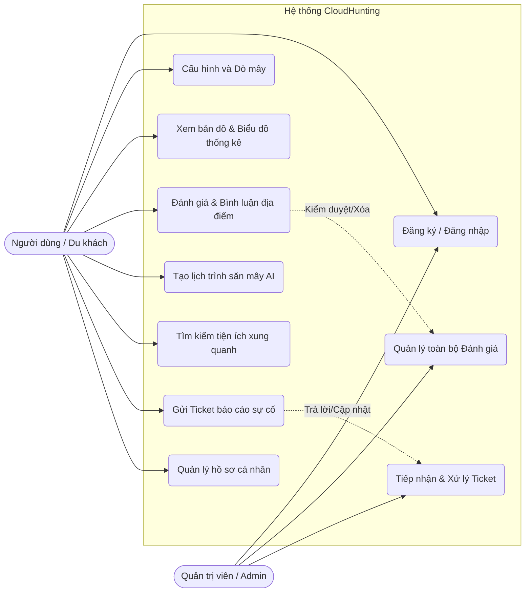

# Sơ đồ Use Case (Ca sử dụng) — CloudHunting

Tài liệu này định nghĩa các tác nhân (Actors) và các chức năng mà họ có thể thực hiện (Use Cases) khi tương tác với hệ thống CloudHunting.

---

## 1. Các tác nhân (Actors)
Hệ thống có 2 tác nhân chính tham gia tương tác:
1. **Người dùng (User):** Là những du khách, người sử dụng ứng dụng để dò tìm thời điểm và địa điểm săn mây tại Đà Lạt, tham khảo các tiện ích xung quanh và tạo lịch trình tự động.
2. **Quản trị viên (Admin):** Là người quản lý hệ thống, kiểm duyệt nội dung do người dùng đăng tải (Đánh giá) và xử lý các vấn đề/báo cáo lỗi.

---

## 2. Sơ đồ Use Case Tổng quan

---

## 3. Đặc tả chi tiết các Use Case chính (Use Case Specification)

### Use Case: Cấu hình và Dò mây (Predict Cloud)
*   **Tác nhân:** Người dùng
*   **Mô tả:** Cho phép người dùng nhập vị trí trung tâm, bán kính (km) và khoảng thời gian (giờ) để AI dự báo các điểm săn mây có tỷ lệ thành công cao nhất.
*   **Tiền điều kiện:** Người dùng đã đăng nhập vào hệ thống.
*   **Luồng sự kiện chính:**
    1. Người dùng chọn vị trí (Mặc định là Đà Lạt).
    2. Kéo thanh trượt để chỉnh bán kính (ví dụ: 15km) và độ trễ thời gian (ví dụ: +12h).
    3. Người dùng nhấn nút "DÒ".
    4. Hệ thống (Gateway) gửi yêu cầu đến Service 1 (AI Predict).
    5. Hệ thống hiển thị danh sách các điểm săn mây phù hợp nhất dưới dạng Carousel.
*   **Luồng ngoại lệ (Alternative Flow):** Nếu thuật toán AI báo về tỷ lệ mây của mọi nơi đều = 0% (Thời tiết xấu), hệ thống sẽ hiển thị Emoji buồn và đề xuất Use Case "Tìm kiếm tiện ích xung quanh" (Quán cafe, ăn sáng) như một Plan B.

### Use Case: Tạo lịch trình săn mây AI (Recommend Itinerary)
*   **Tác nhân:** Người dùng
*   **Mô tả:** Tự động lên lịch trình chi tiết (mấy giờ đi, đi bằng xe gì, chơi gì) dựa trên sở thích cá nhân.
*   **Tiền điều kiện:** Người dùng đã chọn được một điểm săn mây ưng ý từ kết quả dò mây.
*   **Luồng sự kiện chính:**
    1. Người dùng bấm nút "AI Gợi ý giờ xuất phát".
    2. Điền form thông tin: Chọn phương tiện (Ô tô/Xe máy), Phong cách (Chụp ảnh/Cắm trại/Chill), Đi cùng ai (Cặp đôi/Bạn bè).
    3. Nhấn "Tạo lịch trình".
    4. Service 6 (AI Recommend) tính toán đường đi, thời tiết và trả về Timeline chi tiết.
    5. Hệ thống hiển thị giao diện Schedule Timeline cho người dùng.

### Use Case: Quản lý toàn bộ Đánh giá (Manage Reviews)
*   **Tác nhân:** Quản trị viên (Admin)
*   **Mô tả:** Cho phép Admin xem, kiểm soát và xóa các bài đánh giá vi phạm tiêu chuẩn cộng đồng.
*   **Tiền điều kiện:** Admin đã đăng nhập thành công vào Admin Dashboard.
*   **Luồng sự kiện chính:**
    1. Admin chọn tab "Quản lý Đánh giá" trên Sidebar.
    2. Chọn một địa điểm cụ thể từ Menu Dropdown.
    3. Hệ thống hiển thị toàn bộ bài đánh giá của user tại điểm đó.
    4. Admin đọc nội dung, nếu phát hiện spam/vi phạm, bấm nút "Xóa 🗑️".
    5. Hệ thống cập nhật DB (s4_content.db) và load lại bảng.
