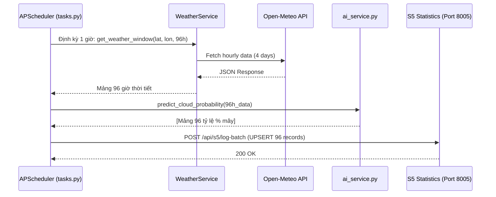
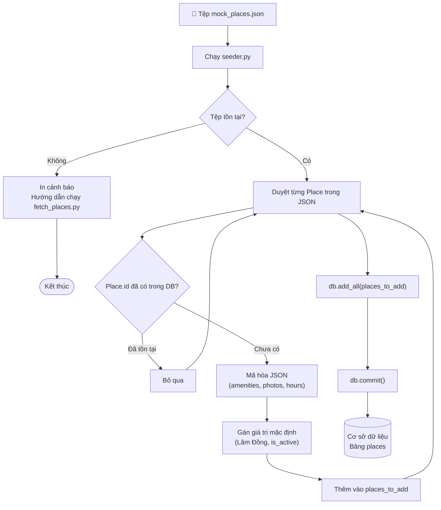
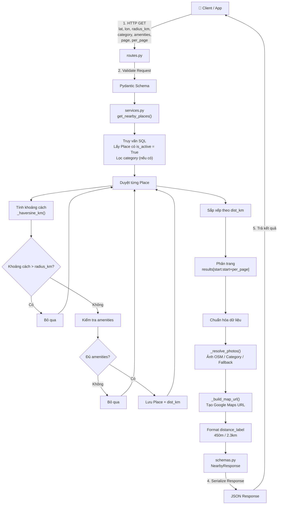
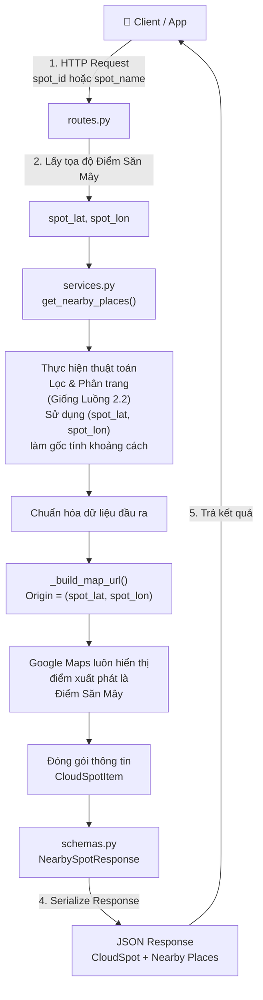
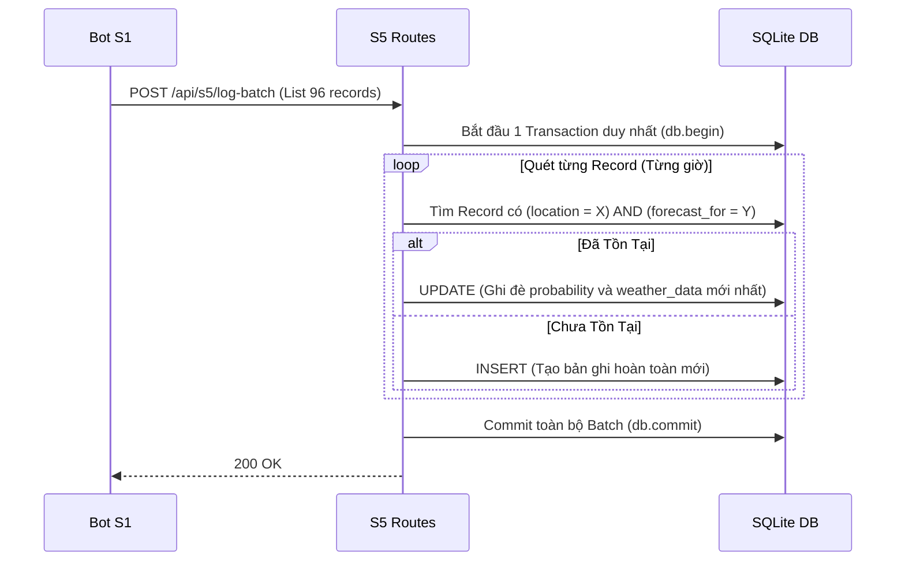
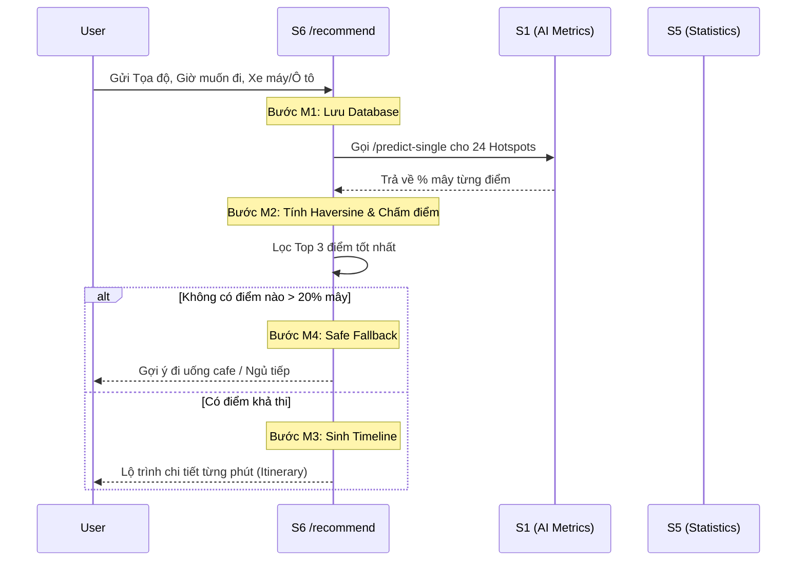

# TÀI LIỆU THIẾT KẾ BACKEND TỔNG HỢP (MASTER DOCUMENT)
---

## 0. API Gateway (Cổng giao tiếp trung tâm)
- **Công nghệ:** FastAPI
- **Port:** `8000`
- **Chức năng chính:**
  - Đóng vai trò là điểm vào (entry point) duy nhất cho toàn bộ các request từ Client (React Frontend).
  - Tự động định tuyến (Routing) request tới đúng Microservice phía sau thông qua các prefix (Ví dụ: `/api/s1` chuyển tới `8001`).
  - Xử lý CORS (Cross-Origin Resource Sharing) để cho phép Frontend kết nối.
  - Tích hợp phân phối mã nguồn Frontend tĩnh (serve file `index.html` và thư mục `dist`).
  - Cung cấp trang Dashboard Swagger UI tổng hợp (`/docs`) để test toàn bộ hệ thống.

---
# BẢN ĐỒ KỸ THUẬT CHI TIẾT: SERVICE 1 (AI METRICS)

**Tên Microservice:** Service 1 - Dự báo Thời tiết & Phân tích Xác suất Mây  
---

## 1. Mục tiêu và Trách nhiệm Hệ thống
Service 1 chịu trách nhiệm cung cấp dữ liệu định lượng (điểm số phần trăm) về khả năng xuất hiện biển mây tại các địa điểm. Nó thực hiện hai nhiệm vụ song song:
1. **Nhiệm vụ ngầm (Background Job):** Quét dữ liệu 24/7, dự báo liên tục cho 24 Hotspots và đẩy về S5.
2. **Nhiệm vụ trực tiếp (API Provider):** Cung cấp API nội bộ cho các Service khác và Giao diện khi có yêu cầu (với cơ chế Fallback chống sập).

---

## 2. Kiến trúc Thư mục và File Lõi (Directory Map)

```text
src/s1_metrics/
├── models/
│   └── cloud_model.pkl        # File trọng số (Weights) của mô hình Random Forest
├── ai_service.py              # Logic tải mô hình và dự báo ma trận (Pandas)
├── weather_service.py         # Gọi API Open-Meteo và cơ chế Caching TTL
├── tasks.py                   # Bot lập lịch APScheduler (Background Scheduler)
├── geocoding_service.py       # Dịch tên địa danh sang Tọa độ (Mapbox/OSM)
├── nearby_service.py          # Thuật toán Haversine đo khoảng cách
├── routes.py                  # API Endpoints & Logic Fallback 3 Tầng
└── schemas.py                 # Pydantic Models (Validate Request/Response)
```

---

## 3. Đặc tả Luồng Hoạt động (Workflows)

### 3.1. Luồng Auto-Scan (Bot chạy ngầm mỗi giờ)
Đây là hệ thống tim phổi của S1, giúp ứng dụng có dữ liệu real-time mà không bắt người dùng phải đợi.



### 3.2. Cơ chế AI Prediction (Bên trong `ai_service.py`)
- Mô hình được huấn luyện bằng thuật toán `RandomForestClassifier` từ thư viện `scikit-learn`.
- Biến global `_model` đảm bảo mô hình chỉ được nạp (load) vào RAM 1 lần duy nhất lúc khởi động server, chống nghẽn bộ nhớ.
- **Features Input (7 biến số độc lập):**
  1. `temperature_2m` (Nhiệt độ)
  2. `relative_humidity_2m` (Độ ẩm)
  3. `wind_speed_10m` (Tốc độ gió)
  4. `pressure_msl` (Áp suất)
  5. `cloud_cover_low` (Mây tầng thấp)
  6. `cloud_cover_high` (Mây tầng cao)
  7. `spread` = Nhiệt độ - Điểm sương (Dew Point) -> *Feature engineering quan trọng nhất để dự đoán sương mù.*
- **Xử lý Batch:** `predict_proba(df_input)` xử lý toàn bộ ma trận thời gian thay vì dùng vòng lặp for, giúp tăng tốc độ dự đoán lên hàng trăm lần.

### 3.3. Luồng Caching Open-Meteo (`weather_service.py`)
- Áp dụng Decorator `@cached(cache=TTLCache(maxsize=100, ttl=3600))`.
- Khi 2 user ở cùng 1 tọa độ yêu cầu thời tiết trong cùng 1 giờ, S1 chỉ gọi Open-Meteo đúng 1 lần, các lần sau lấy từ RAM. Điều này tránh bị khóa API do vượt Rate Limit.

### 3.4. Logic Fallback 3 Tầng (Bên trong `routes.py /predict`)
Đảm bảo API luôn trả về kết quả dưới mọi tình huống (kể cả mạng chậm, API ngoài sập, server AI quá tải).

```mermaid
graph TD
    A[User Request: lat, lon] --> B{Điểm có nằm trong 24 Hotspots?}
    B -- CÓ --> C[TẦNG 1: Fetch từ S5 Database]
    C --> D{Có dữ liệu?}
    D -- CÓ --> E[Trả kết quả ngay (0.1s)]
    
    B -- KHÔNG --> F[Tính Haversine tìm trạm gần nhất <= 15km]
    F --> G[TẦNG 2: Nội suy từ Hotspot gần nhất]
    G --> H{S5 có dữ liệu trạm lân cận?}
    H -- CÓ --> I[Trả kết quả ước tính (0.5s)]
    
    D -- KHÔNG --> J[TẦNG 3: Fetch Open-Meteo + Chạy AI Real-time]
    H -- KHÔNG --> J
    J --> K[Trả kết quả (2-3s)]
```

---

## 4. Giao thức API (API Contract)

### `POST /api/s1/predict`
Dùng cho Giao diện gọi để lấy thông tin chi tiết một vùng săn mây.

**Request Body (JSON):**
```json
{
  "location_name": "Đồi Đa Phú",
  "radius_km": 15.0,
  "forecast_hours": 0
}
```

**Response (JSON):**
```json
{
  "center_location": "Đồi Đa Phú",
  "is_estimated": false,
  "top_spots": [
    {
      "rank": 1,
      "location_name": "Đồi Đa Phú",
      "distance_km": 0.0,
      "probability": 88.5,
      "best_time": "05:30 15/10",
      "timeline": [
        {"time": "04:00 15/10", "probability": 70.0},
        {"time": "05:00 15/10", "probability": 88.5}
      ],
      "confidence": {
        "level": "high",
        "percent": 90,
        "label": "🟢 Rất tin cậy"
      }
    }
  ]
}
```

### `POST /api/s1/predict-single`
Dùng làm endpoint nội bộ để Service 6 gọi (tính toán nhanh 1 điểm). Ưu tiên lấy từ S5, nếu không có mới Real-time.


# BÁO CÁO MODULE S2 - GỢI Ý ĐỊA ĐIỂM 
**Người thực hiện**: Lê Nguyễn Anh Khoa - 24120345
### I. Tổng quan
#### 1. Mục tiêu và phạm vi
- S2 là module hỗ trợ đóng vai trò cung cấp các dịch vụ định vị địa lý, phân loại hình dịch vụ lưu trú – dịch vụ đi kèm, và gợi ý các điểm dừng chân xung quanh tọa độ săn mây hoặc vị trí thực tế của người dùng.
- Được xây dựng trên nền tảng FastAPI kết hợp với SQLAlchemy ORM và Pydantic, tối ưu hóa cho các thao tác đọc dữ liệu không gian hai chiều với hiệu năng tương đối tốt.

#### 2. Vai trò kiến trúc 
Trong tổng thể dự án, S2 giữ nhiệm vụ kết nối trực tiếp dữ liệu địa lý. Nó nhận các tham số đầu vào từ client sau đó thực thi tính toán khoảng cách không gian, xử lý liên kết hình ảnh linh hoạt, chuẩn hóa liên kết điều hướng bản đồ và trả về kết quả dưới dạng cấu trúc phân trang chuẩn.

### II. Phân tích các thành phần module
#### 1. Tầng dữ liệu
Tầng dữ liệu của S2 chịu trách nhiệm lưu trữ thông tin của các địa điểm được cào từ OpenStreetMap (OSM).

- Địa điểm: 
    + Lưu trữ các trường cơ bản như mã định danh duy nhất, tên địa điểm, danh mục hoạt động , tọa độ vĩ độ và kinh độ, địa chỉ chi tiết, tỉnh thành, và trạng thái kích hoạt.
    + Không lưu các trường như text hay rating đánh giá do không có dữ liệu để cào trên OSM.

- Chuẩn hóa dữ liệu cấu trúc phức tạp: Các tập thông tin mở rộng được lưu trữ dưới dạng chuỗi định dạng JSON trong cơ sở dữ liệu để tối ưu hóa khả năng mở rộng schema mà không làm thay đổi cấu trúc bảng.


#### 2. Tầng chuyển đổi dữ liệu
Tầng Schema sử dụng Pydantic để đảm bảo tính toàn vẹn dữ liệu đầu vào và định hình cấu trúc dữ liệu đầu ra:
- Chuẩn hóa tập các danh mục địa điểm hợp lệ bao gồm cà phê, nhà hàng, homestay, khách sạn và điểm cắm trại.

- Định dạng thông tin đầu ra địa điểm chi tiết gửi về cho phía client, bao gồm tọa độ, danh sách tiện ích đã giải mã, danh sách ảnh, nhãn khoảng cách ngắn gọn, liên kết ảnh đại diện chính và đường dẫn trực tiếp tới Google Maps.

- Bao bọc danh sách địa điểm kết hợp với các thông tin bổ trợ như số trang hiện tại, số lượng mục trên mỗi trang, tổng số bản ghi thỏa điều kiện và cờ báo hiệu khả năng chuyển trang tiếp theo.

- Mở rộng phản hồi để bao gồm thông tin chi tiết về tọa độ hoặc tên của điểm săn mây gốc, giúp client hiển thị rõ nét điểm xuất phát và danh sách các dịch vụ phụ trợ xung quanh.


#### 3. Tầng xử lý nghiệp vụ
Đây là trái tim của phân hệ S2, chứa toàn bộ thuật toán tính toán và logic biến đổi dữ liệu.

- Xử lý khoảng cách đường chim bay: Sử dụng công thức toán học chuyên dụng để quy đổi khoảng cách tọa độ vĩ độ và kinh độ trên mặt cầu Trái Đất sang đơn vị kilômét.

- Chuẩn hóa và xử lý ảnh dự phòng: Kiểm tra và phân loại nguồn gốc hình ảnh. 
    + Các ảnh xuất phát từ dữ liệu chính thống được giữ nguyên.
    + Các trường hợp ảnh thiếu nguồn hoặc dữ liệu trống sẽ tự động được gán các liên kết ảnh mặc định chất lượng cao dựa trên thuật toán xoay vòng mã định danh địa điểm và danh mục.

- Tạo liên kết chỉ đường Google Maps linh hoạt: Tự động xây dựng đường dẫn tới dịch vụ bản đồ. 
    + Khi người dùng truy vấn theo vị trí thực tế, điểm xuất phát được để trống để ứng dụng Google Maps tự truy vết vị trí hiện tại. 
    + Khi truy vấn từ một điểm săn mây cố định, điểm xuất phát sẽ được gắn chặt vào tọa độ của điểm săn mây đó.

- Bộ chuyển đổi dữ liệu thực thể sang cấu trúc phản hồi: Thực hiện giải mã các chuỗi JSON tiện ích, giờ mở cửa, xử lý khoảng cách hiển thị và trích xuất hình ảnh đại diện chính.


#### 4. Tầng định tuyến
Tầng này đóng vai trò giao tiếp với bên ngoài, cung cấp các cổng kết nối RESTful:

- API tra cứu địa điểm lân cận vị trí người dùng: Tiếp nhận tọa độ trực tiếp, bán kính tìm kiếm, bộ lọc danh mục và tiện ích để trả về danh sách địa điểm phù hợp đã sắp xếp theo thứ tự từ gần nhất đến xa nhất.

- API tra cứu địa điểm lân cận điểm săn mây: Tiếp nhận mã định danh điểm săn mây hoặc tên địa danh săn mây, xác định tọa độ gốc của điểm đó và tìm kiếm các dịch vụ ăn uống, lưu trú xung quanh.

- API tìm kiếm theo từ khóa: Cho phép người dùng gõ tên địa điểm tự do, truy vấn theo cơ chế tìm kiếm chuỗi không phân biệt hoa thường và tự động tính khoảng cách nếu người dùng có cung cấp tọa độ kèm theo.

- API thống kê danh mục: Báo cáo số lượng địa điểm đang hoạt động được chia theo từng nhóm dịch vụ kèm theo nhãn hiển thị tiếng Việt tương ứng.


### III. Các thuật toán cốt lõi
#### 1. Thuật Toán Tính Khoảng Cách Địa Lý Haversine
Các bước thực hiện thuật toán như sau: 
- Chuyển đổi các giá trị vĩ độ và kinh độ từ độ sang radian.

- Tính toán độ lệch giữa hai điểm trên trục vĩ độ và trục kinh độ.

- Áp dụng công thức lượng giác dựa trên bán kính trung bình của Trái Đất để xác định khoảng cách ngắn nhất trên bề mặt hình cầu.

- Kết quả thu được đạt độ chính xác cao đối với phạm vi tìm kiếm đô thị và du lịch bán kính dưới 100 kilômét.


#### 2. Quy trình xử lý ảnh dự phòng 
Để đảm bảo giao diện ứng dụng không bao giờ bị vỡ hoặc thiếu ảnh hiển thị:

- Đọc dữ liệu mảng ảnh từ chuỗi JSON lưu trữ được cào từ OSM.

- Kiểm tra cờ nguồn gốc của từng tấm ảnh.

- Nếu ảnh có nguồn gốc hợp lệ từ hệ thống bản đồ hoặc danh mục phân loại, giữ nguyên đường dẫn gốc.

- Nếu không có ảnh hoặc ảnh thiếu thông tin nguồn gốc, chuyển đổi đường dẫn sang tập ảnh chuẩn bị sẵn theo thuật toán phân bổ đồng đều dựa trên mã địa điểm.

#### 3. Cơ chế lọc đa điều kiện và phân trang 
Quy trình truy vấn địa điểm được tối ưu qua các bước lọc nối tiếp:
- Chỉ lấy các bản ghi có trạng thái đang hoạt động và khớp chính xác danh mục nếu có yêu cầu.

- Duyệt qua danh sách kết quả, tính khoảng cách Haversine. Loại bỏ các địa điểm nằm ngoài bán kính cho phép.

- Giải mã chuỗi JSON tiện ích của từng địa điểm. Kiểm tra xem địa điểm đó có chứa toàn bộ tập hợp các tiện ích mà người dùng yêu cầu hay không.

- Sắp xếp toàn bộ tập dữ liệu đã vượt qua các vòng lọc theo thứ tự khoảng cách tăng dần. Cắt lát tập dữ liệu theo tham số vị trí trang và số lượng bản ghi trên trang, đồng thời tính toán các tham số chỉ báo phân trang cho client.


### IV. Quy trình khởi tạo dữ liệu
S2 tích hợp sẵn tự động nạp dữ liệu mẫu giúp hệ thống có thể đi vào hoạt động ngay sau khi triển khai:
- Xác định tệp nguồn: Kiểm tra sự tồn tại của tệp dữ liệu cấu hình tĩnh chuẩn JSON trong thư mục dữ liệu cục bộ.

- Cảnh báo thiếu dữ liệu: Nếu tệp nguồn chưa xuất hiện, hệ thống sẽ in ra cảnh báo hướng dẫn nhà phát triển khởi chạy script thu thập dữ liệu tự động.

- Kiểm tra trùng lặp: Đọc toàn bộ danh sách địa điểm trong tệp mẫu, đối soát với cơ sở dữ liệu hiện tại dựa trên mã định danh duy nhất. Bỏ qua các địa điểm đã tồn tại để tránh ghi đè hoặc nhân bản dữ liệu.

- Chuẩn hóa trước khi lưu: Mã hóa các cấu trúc danh sách tiện ích sang định dạng chuỗi JSON hỗ trợ đầy đủ ký tự tiếng Việt .

- Thực thi giao dịch: Lưu toàn bộ các bản ghi mới vào cơ sở dữ liệu trong một giao dịch đơn nhất để đảm bảo tính toàn vẹn dữ liệu.


### V. Kiến trúc luồng hoạt động
#### 1. Luồng khởi tạo dữ liệu



#### 2. Luồng tìm kiếm địa điểm lân cận quanh vị trí người dùng



#### 3. Luồng tìm kiếm địa điểm lân cận quanh địa điểm săn mây 



### VI. Đánh giá
#### 1. Ưu điểm
- Độc lập và Linh hoạt: Mô-đun hóa hoàn toàn các chức năng xử lý không gian, giúp dễ dàng bảo trì hoặc tách thành dịch vụ độc lập trong tương lai.

- Tối ưu trải nghiệm người dùng: Việc tính toán khoảng cách chính xác kết hợp với đường dẫn Google Maps thông minh giúp người dùng chuyển đổi mượt mà từ việc tìm kiếm sang việc di chuyển thực tế.

- Độ tin cậy dữ liệu cao: Cơ chế ảnh dự phòng đa tầng đảm bảo tính thẩm mỹ của giao diện ứng dụng dưới mọi điều kiện dữ liệu đầu vào.


#### 2. Nhược điểm
- Tính khoảng cách (Haversine): Tính toán bằng CPU ở tầng ứng dụng (Python loop). Phải load toàn bộ bản ghi is_active lên RAM rồi mới lọc khoảng cách.  
    -> Suy giảm hiệu năng nghiêm trọng ($O(N)$) khi tập dữ liệu phát triển lên hàng chục nghìn hoặc hàng triệu địa điểm. 

- Lưu trữ JSON Các trường `amenities_json`, `photos_json`, `opening_hours_json` lưu dưới dạng chuỗi thô (text).
    + Không thể tạo index trên các thuộc tính nằm bên trong chuỗi JSON ở mức DB 
    + Việc lọc tiện ích buộc phải parse JSON thủ công trên Python. 

- Cơ chế Tìm kiếm: Sử dụng câu lệnh SQL `ILIKE '%keyword%'` trong hàm `search_places`. 
    + Dẫn đến quét toàn bộ bảng lãng phí tài nguyên, không tận dụng được index B-Tree tiêu chuẩn. 
    + Không hỗ trợ tìm kiếm gõ sai từ/
    
- Xử lý Ảnh Fallback: Hàm `_resolve_photos` parse và fix mảng ảnh realtime mỗi khi có request đọc địa điểm. 

    -> Lãng phí tài nguyên tính toán lặp đi lặp lại cho các dữ liệu tĩnh. 


#### 3. Hướng mở rộng 
- Tích hợp PostGIS hoặc Spatial Indexing: Khi dung lượng dữ liệu địa điểm tăng lên hàng trăm nghìn bản ghi, chuyển việc tính khoảng cách Haversine từ tầng ứng dụng xuống chỉ mục không gian của cơ sở dữ liệu để tối ưu tốc độ truy vấn.

- Bộ nhớ đệm Lân cận: Sử dụng Redis để lưu trữ tạm thời danh sách địa điểm xung quanh các tọa độ săn mây phổ biến nhằm giảm tải cho cơ sở dữ liệu quan hệ.

- Cơ chế Đánh giá và Phản hồi: Mở rộng schema địa điểm để tích hợp điểm đánh giá trung bình và số lượng lượt bình luận từ người dùng thực tế.


---

# BẢN ĐỒ KỸ THUẬT CHI TIẾT: SERVICE 3 (AUTH)

**Tên Microservice:** Service 3 - Quản lý Định danh & Xác thực (Authentication)
---

## 1. Mục tiêu và Trách nhiệm Hệ thống
Service 3 là cổng an ninh của hệ thống. Đảm nhiệm việc xác thực danh tính người dùng, bảo mật mật khẩu và cấp phát quyền (Roles) thông qua JWT.
- Cung cấp tính năng Phân quyền (Role-Based Access Control) cho Admin và User.
- Không cho phép các user chưa đăng nhập thực hiện các hành động nhạy cảm như Đánh giá địa điểm.

## 2. Kiến trúc và Cơ sở dữ liệu
- **Database:** `app.db` (SQLite)
- **Bảng `users`:** Lưu trữ Username, Email, Mật khẩu đã mã hóa (hashed_password), và Quyền (role: `user` hoặc `admin`).
- **Bảo mật:** Sử dụng thư viện `passlib` kết hợp với thuật toán `bcrypt` để băm mật khẩu. Tuyệt đối không lưu mật khẩu thô dưới DB.

## 3. Giao thức API (API Contract)
### `POST /auth/login`
- Nhận Username và Password từ Form (OAuth2PasswordRequestForm).
- So sánh hash trong DB.
- Cấp phát Access Token (JWT) có chứa `sub` (tên người dùng) và `role` (user/admin). Thời hạn Token là 30 phút.

### `POST /auth/register`
- Nhận thông tin đăng ký.
- Kiểm tra Username hoặc Email đã tồn tại chưa.
- Hash password và insert bản ghi mới vào `app.db`.

---

# BẢN ĐỒ KỸ THUẬT CHI TIẾT: SERVICE 4 (CONTENT)

**Tên Microservice:** Service 4 - Quản lý Nội dung Người dùng (UGC)
---

## 1. Mục tiêu và Trách nhiệm Hệ thống
Service 4 quản lý toàn bộ nội dung do người dùng tự tạo ra. Được chia làm 2 phân hệ chính:
- **Hệ thống Đánh giá (Reviews):** Nơi người dùng chấm điểm, review các điểm săn mây và tiện ích (S2).
- **Hệ thống Hỗ trợ (Tickets):** Nơi người dùng báo cáo lỗi, gửi yêu cầu hỗ trợ, và Admin tiếp nhận xử lý.

## 2. Kiến trúc và Cơ sở dữ liệu
- **Database:** `s4_content.db` (SQLite)
- **Bảng `reviews`:** Liên kết `user_id` với `location_id`. Lưu số sao (rating), bình luận (comment) và lượt hữu ích (helpful_count).
- **Bảng `tickets`:** Lưu trạng thái (Open, In Progress, Closed) và phân loại (Bug, Support).

## 3. Giao thức API (API Contract)
- `GET /content/reviews/location/{id}`: Trả về danh sách review của một điểm để Frontend hiển thị lên bảng.
- `POST /content/reviews`: Đăng bài đánh giá mới (Bắt buộc phải có JWT Token hợp lệ từ S3 gửi sang).
- `DELETE /content/reviews/{id}`: Xóa đánh giá rác (Chỉ Admin mới có quyền gọi hàm này dựa vào token payload).
- `POST /content/tickets`: Mở một Ticket hỗ trợ mới.


# BẢN ĐỒ KỸ THUẬT CHI TIẾT: SERVICE 5 (STATISTICS)

**Tên Microservice:** Service 5 - Thống kê, Lưu trữ và Bộ nhớ đệm Tốc độ cao  
---

## 1. Mục tiêu và Trách nhiệm Hệ thống
Service 5 là "Trái tim lưu trữ" của hệ thống CloudHunting. Khác với Database truyền thống chỉ lưu khi có tương tác người dùng, S5 phải xử lý lượng dữ liệu khổng lồ đổ về ngầm mỗi giờ từ S1.
Trách nhiệm của S5:
1. **Ghi đè thông minh (UPSERT):** Chống phình to Database do dữ liệu lặp lại.
2. **Caching Fallback Layer:** Đóng vai trò làm bộ đệm (Cache) tốc độ cao cho Frontend, trả kết quả dự báo trong dưới 0.1 giây.
3. **Phân tích Xu hướng (Trend):** Xử lý dữ liệu lịch sử để tìm ra chu kỳ mây.
4. **Self-Healing:** Tự động dọn rác (dữ liệu quá hạn).

---

## 2. Kiến trúc Thư mục và File Lõi (Directory Map)

```text
src/s5_statistics/
├── database.py                # Cấu hình SQLAlchemy, định nghĩa Table CloudMetricsLog
├── schemas.py                 # Pydantic models (BatchLogItem, ForecastResponse)
├── services.py                # Chứa thuật toán lõi (UPSERT, Phân tích Pandas, Cleanup)
├── routes.py                  # API Endpoints (Giao tiếp với S1, Frontend)
└── s5_statistics.db           # SQLite Database File
```

---

## 3. Lược đồ Cơ sở Dữ liệu (Database Schema)

**Bảng: `cloud_metrics_log`** (Bảng duy nhất nhưng chịu tải cao)

| Trường (Column) | Kiểu dữ liệu (SQLAlchemy) | Mô tả & Ràng buộc |
|---|---|---|
| `id` | Integer | Khóa chính (Primary Key), Auto Increment |
| `location_name` | String | Tên địa điểm (Được đánh Index để truy vấn nhanh) |
| `lat` / `lon` | Float | Tọa độ địa lý |
| `probability` | Float | % xác suất mây do S1 tính ra |
| `forecast_for` | DateTime | Thời điểm dự báo (Được đánh Index). *Quan trọng nhất* |
| `record_type` | String | Phân loại: `historical`, `current`, `forecast_d1`, `d2`, `d3`, `d4` |
| `created_at` | DateTime | Thời gian bản ghi được ghi đè/tạo mới lần cuối |
| 7 trường Weather | Float | Nhiệt độ, độ ẩm, tốc độ gió, áp suất, mây thấp, mây cao, điểm sương |

---

## 4. Đặc tả Luồng Hoạt động (Workflows & Algorithms)

### 4.1. Luồng Ghi đè Thông minh (Batch UPSERT)
Khi Bot S1 gửi hàng ngàn bản ghi về, nếu Insert toàn bộ thì DB sẽ sập chỉ sau vài ngày. S5 giải quyết bằng thuật toán **Update Or Insert (UPSERT)**.


*Tối ưu:* Quá trình trên sử dụng chung 1 transaction thay vì commit cho từng row, tăng tốc độ xử lý I/O của SQLite lên hàng trăm lần.

### 4.2. Luồng Phân tích Xu hướng 30 Ngày (Trend Analysis)
Nằm trong hàm `get_statistics(db, location_name, days=30)`:
1. Lọc tất cả các bản ghi có `record_type` là `historical` hoặc `current` trong 30 ngày qua.
2. Đưa dữ liệu thô vào `Pandas DataFrame`.
3. Nhóm theo ngày (`groupby('date')`) và tính tỷ lệ trung bình mỗi ngày (`mean()`).
4. Thuật toán Trend: So sánh `probability` ngày X so với ngày X-1:
   - Nếu $>$ (Cũ + 5%) $\rightarrow$ Nhãn: **Tăng**
   - Nếu $<$ (Cũ - 5%) $\rightarrow$ Nhãn: **Giảm**
   - Còn lại $\rightarrow$ Nhãn: **Đi ngang**.

### 4.3. Luồng Tự Động Dọn Rác (Garbage Collection)
Hàm `cleanup_old_records()` chạy định kỳ để bảo vệ ổ cứng:
- `DELETE WHERE record_type = 'historical' AND forecast_for < (NOW - 30 days)`
- `DELETE WHERE record_type LIKE 'forecast%' AND forecast_for < (NOW - 12 hours)` (Chống lỗi Bot sập khiến dự báo tương lai bị kẹt lại thành quá khứ).

---

## 5. Giao thức API (API Contract)

### `POST /api/s5/log-batch` (Nhận dữ liệu từ S1)
**Request Body:**
```json
{
  "logs": [
    {
      "location_name": "Đồi Đa Phú",
      "lat": 11.9, "lon": 108.4,
      "probability": 88.5,
      "forecast_for": "2023-10-15T05:00:00",
      "record_type": "forecast_d1",
      "weather_data": { "temperature_2m": 15, "relative_humidity_2m": 95, ... }
    }
  ]
}
```

### `GET /api/s5/forecast/{location_name}` (Cung cấp cho Frontend)
Đây là API Tầng 1 của Smart Fallback, phản hồi dưới 0.1s.
**Response:**
```json
{
  "location_name": "Đồi Đa Phú",
  "current": {
    "probability": 85.0,
    "confidence": {"level": "high", "label": "🟢 Rất tin cậy"}
  },
  "forecast": [
     {"forecast_for": "2023-10-15T05:00", "probability": 88.5}
  ],
  "history": [
     {"date": "2023-10-14", "avg_probability": 60, "trend": "Tăng"}
  ]
}
```


# BẢN ĐỒ KỸ THUẬT CHI TIẾT: SERVICE 6 (RECOMMEND)

**Tên Microservice:** Service 6 - Gợi ý Lộ trình (Itinerary) và Kịch bản Bẻ lái (Plan B)  
---

## 1. Mục tiêu và Trách nhiệm Hệ thống
Service 6 là lớp giao tiếp nghiệp vụ cuối cùng trước khi trả dữ liệu cho Giao diện. S6 biến những con số khô khan (% mây) của S1 và S5 thành các **Hành động cụ thể** cho người dùng (Chạy xe lúc mấy giờ? Điểm dừng ở đâu? Quẹo trái hay phải khi có sự cố?).
Trách nhiệm của S6:
1. **Pipeline 4 Bước:** M1 (Nhận sở thích) $\rightarrow$ M2 (Chấm điểm) $\rightarrow$ M3 (Sinh Timeline) $\rightarrow$ M4 (Fallback).
2. **Thuật toán Plan B:** Xử lý sự cố thời tiết giữa đường.
3. **News Feed Cảnh báo:** Quản lý bảng tin "Cơ hội vàng" cho cộng đồng.

---

## 2. Kiến trúc Thư mục và File Lõi (Directory Map)

```text
src/s6_recommend/
├── database.py                # Định nghĩa UserPreference, NotificationLog
├── schemas.py                 # Pydantic models (UserPreferenceRequest, ItineraryResponse)
├── integrations.py            # Giao tiếp HTTP nội bộ gọi S1 (8001) và S5 (8005)
├── services.py                # Chứa thuật toán lõi (M1-M4, Haversine, Plan B)
├── routes.py                  # API Endpoints
└── s6_preferences.db          # SQLite chứa sở thích người dùng và log
```

---

## 3. Đặc tả Luồng Hoạt động (Workflows & Algorithms)

### 3.1. Pipeline Tạo Lộ trình Cốt lõi (`/recommend`)
Luồng xử lý chính khi người dùng bấm "Lên lịch trình".



### 3.2. Thuật toán Tính điểm (Scoring) và Khoảng cách (Haversine)
- **Công thức Haversine:** S6 tự tính toán khoảng cách đường chim bay giữa điểm xuất phát (của user) và 24 Hotspots để trừ hao thời gian di chuyển.
  $$ a = \sin^2\left(\frac{\Delta\phi}{2}\right) + \cos(\phi_1)\cos(\phi_2)\sin^2\left(\frac{\Delta\lambda}{2}\right) $$
  $$ c = 2 \cdot \text{atan2}(\sqrt{a}, \sqrt{1-a}) $$
  $$ d = R \cdot c \quad (\text{với } R = 6371 \text{ km}) $$
- **Logic Tính thời gian (Timeline):**
  - Xe máy (`motorbike`): Tốc độ trung bình $35$ km/h.
  - Ô tô (`car`): Tốc độ trung bình $45$ km/h.
  - **Giờ khởi hành** = `Giờ đón bình minh (best_time)` - `Thời gian chạy xe (d / v)` - `Thời gian leo dốc (30 phút)` - `Cafe (nếu có)`.

### 3.3. Thuật toán Bẻ lái - Plan B (`/plan-b`)
Khi người dùng đang đi được nửa đường, hệ thống cảnh báo mây tan ở điểm đích.
1. Nhận tọa độ GPS *hiện tại* đang đứng giữa đường.
2. Quét bán kính giới hạn (Max 15km) bằng Haversine.
3. Gọi S5 để check % mây các điểm trong bán kính đó.
4. Lọc ra đỉnh đồi thay thế có % mây $>$ % mây của đích đến cũ.
5. Sinh lại Timeline (Tính khoảng cách từ chỗ đang đứng tới đích mới).
*Nếu tất cả đều mù mịt, Plan B sẽ tự động chốt một tọa độ quán Cafe trú ẩn an toàn nhất.*

---

## 4. Lược đồ Cơ sở Dữ liệu (Database Schema)

**Bảng `user_preferences`** (Phục vụ phân tích UX sau này)
| Trường | Kiểu | Mô tả |
|---|---|---|
| `id` | Integer | PK |
| `start_lat`, `start_lon` | Float | Tọa độ lúc người dùng gọi API |
| `transport_mode` | String | `motorbike` hoặc `car` |
| `prefer_camping` | Boolean | True/False |
| `created_at` | DateTime | Giờ tạo yêu cầu |

**Bảng `notification_logs`** (News Feed Cảnh báo)
| Trường | Kiểu | Mô tả |
|---|---|---|
| `location_name` | String | Tên đồi có mây cao |
| `message` | String | Nội dung: "Cơ hội vàng tại Đồi Đa Phú..." |
| `probability` | Float | % mây lúc cảnh báo (> 85%) |

---

## 5. Giao thức API (API Contract)

### `POST /api/s6/recommend`
**Request Body:**
```json
{
  "location_name": "Chợ Đà Lạt",
  "start_lat": 11.940,
  "start_lon": 108.435,
  "transport_mode": "motorbike",
  "prefer_camping": false,
  "target_time": "2023-10-15T05:00:00"
}
```

**Response:**
```json
{
  "location_name": "Đồi Đa Phú",
  "probability": 88.5,
  "distance_km": 12.3,
  "timeline": [
    {
      "time": "04:15",
      "action": "Xuất phát từ Chợ Đà Lạt bằng xe máy"
    },
    {
      "time": "04:40",
      "action": "Dừng chân nghỉ ngơi / Mua đồ uống"
    },
    {
      "time": "05:05",
      "action": "Bắt đầu leo dốc"
    },
    {
      "time": "05:30",
      "action": "🌅 Đón bình minh và biển mây (Golden Hour)"
    }
  ],
  "is_fallback": false
}
```
