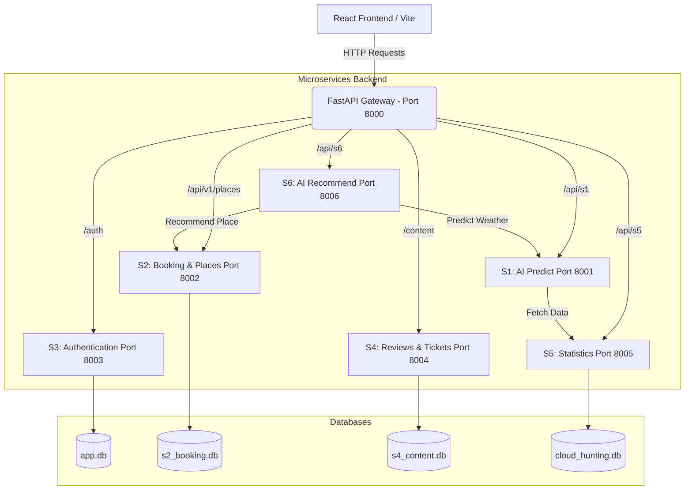
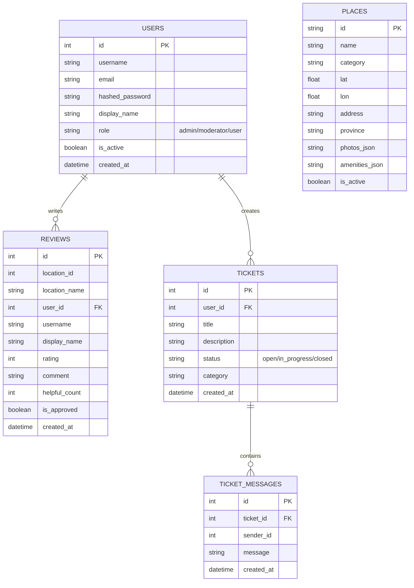
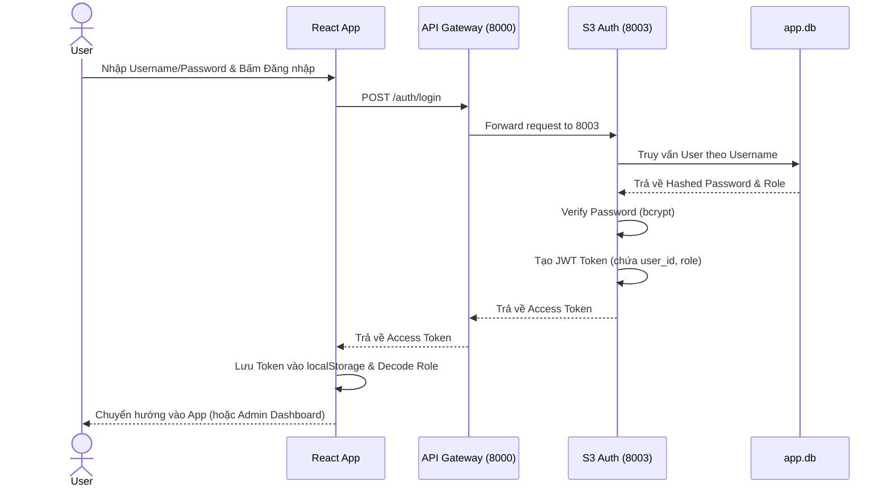

# Tài liệu Thiết kế Hệ thống

Dựa vào mã nguồn của dự án `MergePro`, dưới đây là các biểu đồ thiết kế kỹ thuật.

## 1. Sơ đồ Kiến trúc Tổng quan (Architecture Diagram)
Hệ thống được thiết kế theo kiến trúc **Microservices** (Dịch vụ siêu nhỏ), giao tiếp thông qua một API Gateway.

## 2. Thiết kế Cơ sở dữ liệu (ERD - Entity Relationship Diagram)
Cấu trúc các bảng dữ liệu chính.

## 3. Sơ đồ luồng (Sequence Diagram) - Ví dụ: Luồng Đăng nhập

