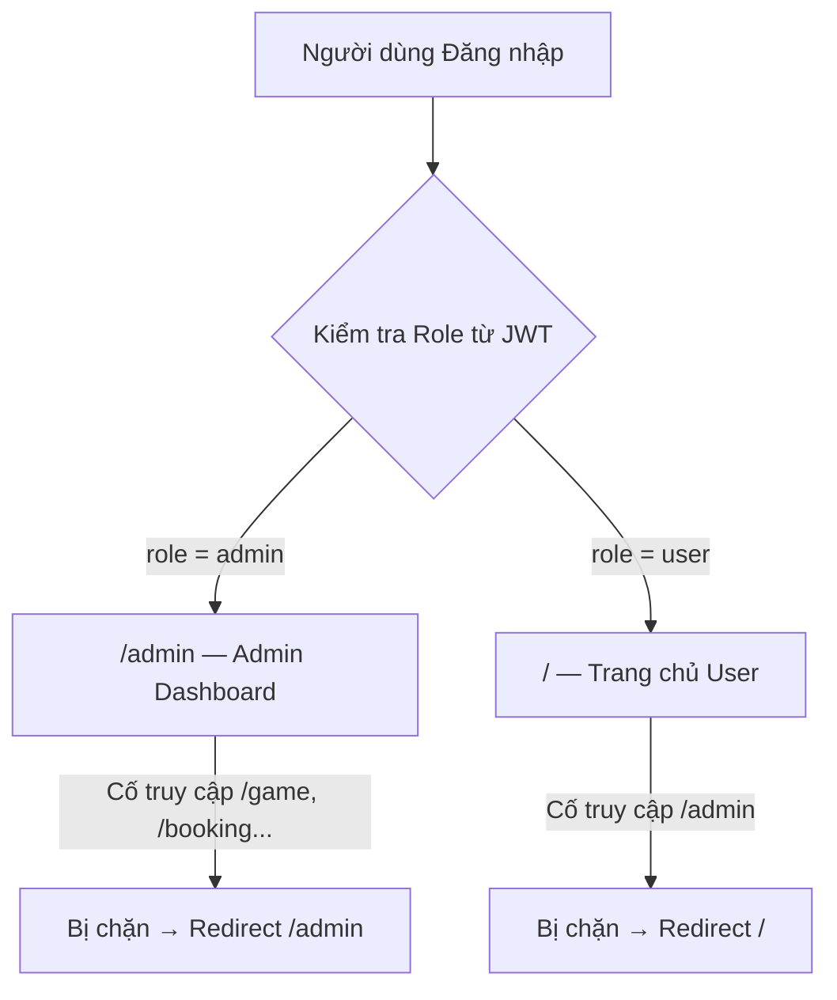
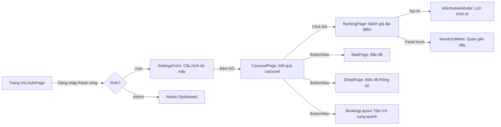

# Tài liệu Thiết kế Frontend — CloudHunting

> **Dự án:** CloudHunting — Ứng dụng săn mây Đà Lạt  
> **Framework:** React 19 + Vite 8  
> **Đường dẫn mã nguồn:** `frontend/cloud-hunting-app/src/`  
> **Ngày tạo:** 22/07/2026  

---

## Mục lục

1. [Công nghệ sử dụng](#1-công-nghệ-sử-dụng)
2. [Cấu trúc thư mục](#2-cấu-trúc-thư-mục)
3. [Hệ thống Routing & Phân quyền](#3-hệ-thống-routing--phân-quyền)
4. [Chi tiết từng Trang (Pages)](#4-chi-tiết-từng-trang-pages)
5. [Chi tiết từng Component](#5-chi-tiết-từng-component)
6. [Tầng API Bridge](#6-tầng-api-bridge)
7. [Custom Hooks](#7-custom-hooks)
8. [Utility Functions](#8-utility-functions)
9. [Phương pháp quản lý CSS](#9-phương-pháp-quản-lý-css)
10. [Quản lý State](#10-quản-lý-state)
11. [Luồng người dùng tổng thể](#11-luồng-người-dùng-tổng-thể)

---

## 1. Công nghệ sử dụng

### 1.1 Build Tool
- **Vite 8.0.12** với plugin `@vitejs/plugin-react 6.0.1`
- Cấu hình tối giản (chỉ khai báo React plugin, không có alias hay proxy)

### 1.2 Thư viện Runtime

| Thư viện | Phiên bản | Vai trò |
|---|---|---|
| `react` | 19.2.6 | Framework giao diện |
| `react-dom` | 19.2.6 | Render DOM |
| `react-router-dom` | 7.17.0 | Routing (điều hướng trang) |
| `leaflet` | 1.9.4 | Engine bản đồ tương tác |
| `react-leaflet` | 5.0.0 | Binding React cho Leaflet |
| `chart.js` | 4.5.1 | Engine vẽ biểu đồ |
| `react-chartjs-2` | 5.3.1 | Binding React cho Chart.js |

### 1.3 Thư viện Dev

| Thư viện | Phiên bản | Vai trò |
|---|---|---|
| `eslint` | 10.3 | Kiểm tra chất lượng mã nguồn |
| `vite` | 8.0.12 | Công cụ build & dev server |

### 1.4 Entry Point
File `main.jsx` sử dụng `BrowserRouter` với `basename` động: nếu URL bắt đầu bằng `/app` thì dùng `/app`, ngược lại dùng `''`. Được bọc trong `StrictMode` của React.

---

## 2. Cấu trúc thư mục

```
src/
├── main.jsx                    # Entry point, cấu hình Router
├── App.jsx                     # Khai báo Routes & Route Guards
├── index.css                   # CSS toàn cục (biến, reset, gradient nền)
│
├── pages/                      # Các trang chính (mỗi trang = 1 route)
│   ├── AuthPage/               # Trang đăng nhập / đăng ký
│   ├── CloudGamePage/          # Trang mini-game bắt mây
│   ├── CarouselPage/           # Trang kết quả dự báo (carousel)
│   ├── DetailPage/             # Trang biểu đồ thống kê
│   ├── MapPage/                # Trang bản đồ Leaflet
│   ├── RankingPage/            # Trang đánh giá & xếp hạng
│   ├── AdminDashboard/         # Trang quản trị (dành riêng Admin)
│   └── ProfilePage/            # Trang hồ sơ cá nhân
│
├── components/                 # Các component tái sử dụng
│   ├── AuthForms/              # LoginForm, RegisterForm
│   ├── CenterCard/             # Card glassmorphism trung tâm
│   ├── SettingsForm/           # Form cấu hình dò mây
│   ├── TopRightNav/            # Thanh điều hướng góc phải
│   ├── BottomNav/              # Thanh điều hướng dưới cùng
│   ├── Cloud/                  # Đám mây đơn lẻ (animation)
│   ├── CloudGameLayer/         # Layer game bắt mây
│   ├── ScoreBoard/             # Bảng điểm game
│   ├── VolumeControl/          # Nút điều chỉnh âm lượng
│   ├── BackgroundOrbs/         # Hiệu ứng orb trang trí
│   ├── Carousel/               # Carousel kết quả săn mây
│   ├── LocationMap/            # Bản đồ Leaflet (trang Map)
│   ├── StatsChart/             # Biểu đồ Chart.js
│   ├── ReviewCard/             # Card đánh giá (CRUD đầy đủ)
│   ├── NearbyUtilities/        # Panel tiện ích xung quanh
│   ├── Booking/                # Layout trang Booking (Places)
│   ├── AiSchedule/             # Modal lịch trình AI
│   ├── Schedule/               # Layout lịch trình săn mây
│   ├── Support/                # Báo cáo sự cố & Chat
│   └── DeleteConfirmModal/     # Modal xác nhận xóa
│
├── bridge/                     # Tầng giao tiếp API
│   ├── s1_api.js               # API Service 1 (AI Predict)
│   ├── s2_api.js               # API Service 2 (Places)
│   ├── s3_api.js               # API Service 3 (Auth)
│   ├── s4_api.js               # API Service 4 (Reviews, Tickets)
│   └── s6_api.js               # API Service 6 (AI Recommend)
│
├── hooks/                      # Custom React Hooks
│   ├── useAudio.js             # Quản lý nhạc nền & hiệu ứng âm
│   ├── useCloudSpawner.js      # Sinh đám mây ngẫu nhiên
│   └── useScore.js             # Quản lý điểm game (localStorage)
│
├── utils/                      # Hàm tiện ích
│   ├── authUtils.js            # Giải mã JWT, lấy role
│   └── timeUtils.js            # Tính giờ khởi hành thông minh
│
└── assets/                     # Tài nguyên tĩnh (hình ảnh, âm thanh)
```

---

## 3. Hệ thống Routing & Phân quyền

### 3.1 Sơ đồ phân quyền



### 3.2 Bảng Routes

| Route | Component | Bảo vệ | Mô tả |
|---|---|---|---|
| `/` | `AuthPage` | Không (Admin auto-redirect → `/admin`) | Trang chủ: Đăng nhập / Đăng ký |
| `/admin` | `AdminDashboard` | `ProtectedAdminRoute` | Bảng điều khiển quản trị |
| `/game` | `CloudGamePage` | `ProtectedUserRoute` | Mini-game bắt mây |
| `/results` | `CarouselPage` | `ProtectedUserRoute` | Kết quả dự báo dạng carousel |
| `/detail` | `DetailPage` | `ProtectedUserRoute` | Biểu đồ xác suất mây theo thời gian |
| `/map` | `MapPage` | `ProtectedUserRoute` | Bản đồ tương tác các điểm săn mây |
| `/ranking` | `RankingPage` | `ProtectedUserRoute` | Đánh giá & xếp hạng địa điểm |
| `/booking` | `BookingLayout` | `ProtectedUserRoute` | Khám phá tiện ích xung quanh |
| `/schedule` | `ScheduleLayout` | `ProtectedUserRoute` | Lịch trình săn mây do AI tạo |
| `/support` | `SupportTickets` | `ProtectedUserRoute` | Gửi báo cáo sự cố |
| `/profile` | `ProfilePage` | `ProtectedUserRoute` | Hồ sơ cá nhân & lịch sử đánh giá |

### 3.3 Cơ chế bảo vệ Route
- **`ProtectedUserRoute`:** Nếu user là Admin → redirect sang `/admin`. Ngăn Admin xem giao diện User.
- **`ProtectedAdminRoute`:** Nếu user không phải Admin → redirect về `/`. Ngăn User xâm nhập Dashboard.
- Kiểm tra role bằng hàm `isAdmin()` từ `utils/authUtils.js`, giải mã trực tiếp JWT token đang lưu trong `localStorage`.

---

## 4. Chi tiết từng Trang (Pages)

### 4.1 AuthPage — Trang Đăng nhập (`/`)

| Thuộc tính | Chi tiết |
|---|---|
| **Giao diện** | Nền gradient xanh trời với các đám mây hoạt hình bay qua (mini-game layer). Card kính mờ (glassmorphism) ở giữa hiển thị form Đăng nhập / Đăng ký. Sau khi đăng nhập, card chuyển thành form cấu hình dò mây. |
| **Components** | `CloudGameLayer`, `CenterCard` → (`LoginForm` \| `RegisterForm` \| `SettingsForm`), `TopRightNav` |
| **API gọi** | `s3_api.login()`, `s3_api.register()`, `s1_api.predictCloud()` |
| **State** | `isLoggedIn` (từ `localStorage.accessToken`), `score` (từ hook `useScore`) |

---

### 4.2 CloudGamePage — Mini-game Bắt mây (`/game`)

| Thuộc tính | Chi tiết |
|---|---|
| **Giao diện** | Game toàn màn hình: đám mây trôi ngang qua, click vào mây để cộng điểm. |
| **Components** | `CloudGameLayer` |
| **API gọi** | Không có |
| **State** | Score lưu trong `localStorage` qua hook `useScore` |

---

### 4.3 CarouselPage — Kết quả Dự báo (`/results`)

| Thuộc tính | Chi tiết |
|---|---|
| **Giao diện** | Carousel ngang hiển thị các thẻ kết quả. Mỗi thẻ gồm: tên địa điểm, xác suất mây (%), khoảng cách (km), thời điểm lý tưởng, hình ảnh. Nếu không có điểm nào khả thi (xác suất = 0), hiện emoji buồn và gợi ý khám phá tiện ích thay thế. Thanh điều hướng 4 nút ở dưới cùng. |
| **Components** | `CloudGameLayer`, `Carousel`, `BottomNav`, `TopRightNav`, `AmenitiesModal` |
| **API gọi** | Không trực tiếp (dữ liệu nhận qua `location.state.cloudData`) |
| **State** | `cloudData` từ router state. Lọc `probability > 0`. |

---

### 4.4 DetailPage — Biểu đồ Thống kê (`/detail`)

| Thuộc tính | Chi tiết |
|---|---|
| **Giao diện** | Biểu đồ đường Chart.js hiển thị xác suất mây theo thời gian cho từng địa điểm. Trục X = giờ trong ngày, trục Y = xác suất (0–100%). Mỗi địa điểm là 1 đường màu riêng. Có nút "Quay lại" và "Tìm dịch vụ gần đây". |
| **Components** | `CloudGameLayer`, `StatsChart`, `TopRightNav` |
| **API gọi** | Không (dữ liệu từ router state) |
| **State** | `cloudData` và `timeOffset` từ router state |

---

### 4.5 MapPage — Bản đồ Tương tác (`/map`)

| Thuộc tính | Chi tiết |
|---|---|
| **Giao diện** | Bản đồ Leaflet toàn màn hình. Top 3 điểm săn mây có marker hình tròn Vàng/Bạc/Đồng với số thứ hạng. Các điểm còn lại là chấm xám nhỏ. Click marker hiện popup tên, xác suất, gợi ý. Bản đồ tự zoom vừa tất cả marker. Có overlay tên Biển Đông, Hoàng Sa, Trường Sa (chủ quyền). |
| **Components** | `CloudGameLayer`, `LocationMap`, `TopRightNav` |
| **API gọi** | `s2_api.fetchCloudSpots()` (khi không có dữ liệu tìm kiếm) |
| **State** | `cloudData` từ router state |

---

### 4.6 RankingPage — Đánh giá & Xếp hạng (`/ranking`)

| Thuộc tính | Chi tiết |
|---|---|
| **Giao diện** | Chia 2 cột. Cột trái: ảnh địa điểm + nút "Khám phá tiện ích". Cột phải: danh sách đánh giá (sao, bình luận, nút like, sửa/xóa cho bài của mình). Nút nổi: "AI gợi ý giờ xuất phát" và "Viết đánh giá". Modal viết review, gợi ý thời gian AI, xác nhận xóa. |
| **Components** | `CloudGameLayer`, `ReviewCard`, `TopRightNav` |
| **API gọi** | `s4_api.fetchReviews()`, `postReview()`, `editReview()`, `deleteReview()`, `likeReview()`, `unlikeReview()`, `POST /api/s6/recommend` |
| **State** | Reviews từ API, likedReviews trong `localStorage`, user info từ JWT |

---

### 4.7 AdminDashboard — Bảng quản trị (`/admin`)

| Thuộc tính | Chi tiết |
|---|---|
| **Giao diện** | Layout sidebar chuyên nghiệp. Sidebar: branding "CloudHunting ADMIN", avatar admin, 2 tab điều hướng (Đánh giá / Phản hồi), nút đăng xuất. Nội dung chính hiển thị theo tab đang chọn. |
| **Tab Đánh giá** | Dropdown chọn địa điểm → Bảng review gồm cột: ID, Người dùng, Số sao, Nội dung, Ngày, Nút Xóa. |
| **Tab Phản hồi** | Bảng ticket từ người dùng gồm cột: Mã ticket, Người gửi, Tiêu đề, Ngày, Trạng thái (badge màu), Chi tiết + Nút đánh dấu đã xử lý. |
| **API gọi** | `s4_api.fetchReviews()`, `deleteReview()`, `fetchTickets()`, `updateTicketStatus()` |

---

### 4.8 ProfilePage — Hồ sơ cá nhân (`/profile`)

| Thuộc tính | Chi tiết |
|---|---|
| **Giao diện** | Panel glassmorphism có nền orb động. Bên trái: avatar (chữ cái đầu), tên hiển thị, email, số lượng review. Bên phải: danh sách review của bản thân (tên địa điểm, ngày, nội dung, sao, lượt thích, nút xóa). |
| **Components** | `TopRightNav`, `DeleteConfirmModal` |
| **API gọi** | `s4_api.fetchMyReviews()`, `deleteReview()` |
| **State** | User info giải mã từ JWT |

---

### 4.9 BookingLayout — Tiện ích xung quanh (`/booking`)

| Thuộc tính | Chi tiết |
|---|---|
| **Giao diện** | Layout chia đôi. Bên trái: Danh sách quán (PlacesList) với bộ lọc danh mục (Tất cả, Cafe, Homestay, Nhà hàng, Khách sạn, Cắm trại) + lọc tiện ích (view mây, bãi đỗ xe, wifi, mở đêm). Bên phải: Bản đồ (BookingMap) hiển thị marker các quán. |
| **Components** | `PlacesList`, `BookingMap`, `TopRightNav` |
| **API gọi** | `s2_api.fetchNearbyUtilities()` |

---

### 4.10 ScheduleLayout — Lịch trình AI (`/schedule`)

| Thuộc tính | Chi tiết |
|---|---|
| **Giao diện** | 2 panel. Panel trái: danh sách địa điểm gợi ý + timeline lịch trình (giờ, địa điểm, hành động, ghi chú). Panel phải: thông báo cảnh báo thời tiết với chỉ báo màu sắc. |
| **Components** | `ScheduleTimeline`, `WeatherAlert`, `TopRightNav` |
| **API gọi** | `POST /api/s6/recommend`, `GET /api/s6/notifications` |

---

## 5. Chi tiết từng Component

### 5.1 Nhóm Authentication

#### LoginForm
| Thuộc tính | Chi tiết |
|---|---|
| **Mục đích** | Form đăng nhập username/password |
| **Props** | `onLogin` (callback khi thành công) |
| **Tính năng** | Gọi `s3_api.login()`, hiển thị lỗi, trạng thái loading |

#### RegisterForm
| Thuộc tính | Chi tiết |
|---|---|
| **Mục đích** | Form đăng ký (email, tên hiển thị, username, mật khẩu) |
| **Props** | Không có |
| **Tính năng** | Gọi `s3_api.register()`, thông báo thành công/thất bại, reset form |

#### CenterCard
| Thuộc tính | Chi tiết |
|---|---|
| **Mục đích** | Card glassmorphism trung tâm, chuyển đổi giữa Login/Register/Settings |
| **Props** | `isLoggedIn`, `onLogin`, `onLogout` |
| **Tính năng** | Tab switching (Đăng nhập ↔ Đăng ký). Khi đã login → hiển thị `SettingsForm` |

#### SettingsForm
| Thuộc tính | Chi tiết |
|---|---|
| **Mục đích** | Form cấu hình tham số dò mây (giao diện chính sau khi đăng nhập) |
| **Props** | Không có |
| **Tính năng** | Input tên vị trí (mặc định "Đà Lạt"), slider bán kính (1–50 km), slider offset thời gian (0–72 giờ). Gọi `s1_api.predictCloud()` rồi điều hướng sang `/results` kèm data |

---

### 5.2 Nhóm Điều hướng

#### TopRightNav
| Thuộc tính | Chi tiết |
|---|---|
| **Mục đích** | Thanh user góc phải trên (chào user + menu dropdown) |
| **Props** | `onLogout` (callback) |
| **Tính năng** | Hiển thị "Chào, {displayName}" giải mã từ JWT. Dropdown: Hồ sơ, Hỗ trợ, Đăng xuất. Click-outside-to-close |

#### BottomNav
| Thuộc tính | Chi tiết |
|---|---|
| **Mục đích** | Thanh điều hướng 4 nút ở dưới trang kết quả |
| **Props** | Không (đọc từ router location state) |
| **Tính năng** | Điều hướng tới: Booking, Map, Home (tìm kiếm mới), Detail (thống kê) |

---

### 5.3 Nhóm Mini-game

#### CloudGameLayer
| Thuộc tính | Chi tiết |
|---|---|
| **Mục đích** | Container layer tổng hợp toàn bộ game bắt mây |
| **Props** | `spawnRate` ('normal' \| 'slow'), `initialClouds` (mặc định 3) |
| **Tính năng** | Điều phối `useAudio`, `useScore`, `useCloudSpawner`. Click mây = tan biến (điểm+1 + âm thanh pop). Mây trôi khỏi màn hình = tự biến mất |

#### Cloud
| Thuộc tính | Chi tiết |
|---|---|
| **Mục đích** | Phần tử đám mây đơn lẻ với hoạt hình trôi hình sin |
| **Props** | `id`, `color`, `startY`, `fromLeft`, `scale`, `duration`, `amplitude`, `frequency`, `onDissipate`, `onExpire` |
| **Tính năng** | Web Animations API cho keyframe mượt mà. Kéo thả (drag): nếu khoảng cách < 3px → xem như click (tan biến); nếu kéo xa hơn → tiếp tục trôi từ vị trí thả. CSS class `dissipating` cho hiệu ứng mờ dần |

#### ScoreBoard
| Thuộc tính | Chi tiết |
|---|---|
| **Mục đích** | Hiển thị điểm số game với animation |
| **Props** | `score` (number) |
| **Tính năng** | Animation phóng to khi điểm thay đổi. Vị trí cố định trên màn hình |

#### VolumeControl
| Thuộc tính | Chi tiết |
|---|---|
| **Mục đích** | Thanh trượt điều chỉnh âm lượng nhạc nền |
| **Props** | `onVolumeChange`, `defaultVolume` (mặc định 0.25) |
| **Tính năng** | Range input (0–1, step 0.01) với emoji nhạc 🎵 |

---

### 5.4 Nhóm Hiển thị Kết quả

#### Carousel
| Thuộc tính | Chi tiết |
|---|---|
| **Mục đích** | Carousel ngang cho kết quả dự báo mây |
| **Props** | `data` (mảng các spot) |
| **Tính năng** | Responsive: 1 card (mobile), 2 (tablet), 3 (desktop). Nút mũi tên trái/phải. Mỗi thẻ: ảnh, tên, xác suất %, khoảng cách, giờ tốt nhất. Click thẻ → đi tới `/ranking` |

#### LocationMap
| Thuộc tính | Chi tiết |
|---|---|
| **Mục đích** | Bản đồ Leaflet hiển thị các điểm săn mây với marker xếp hạng |
| **Props** | `data` (mảng các spot) |
| **Tính năng** | Marker Vàng/Bạc/Đồng cho Top 3. Auto-fit bounds. Popup: tên, hạng, xác suất, gợi ý. Overlay chủ quyền Việt Nam. Fallback gọi `s2_api.fetchCloudSpots()` |

#### StatsChart
| Thuộc tính | Chi tiết |
|---|---|
| **Mục đích** | Biểu đồ đường xác suất mây theo timeline bằng Chart.js |
| **Props** | `data` (mảng spots có timeline), `timeOffset` |
| **Tính năng** | Tối đa 5 đường màu. Responsive width. Custom tooltip hiển thị %. Nút điều hướng tới booking |

---

### 5.5 Nhóm Đánh giá & Tương tác

#### ReviewCard *(Component phức tạp nhất — 562 dòng)*
| Thuộc tính | Chi tiết |
|---|---|
| **Mục đích** | Panel đánh giá đầy đủ CRUD cho một địa điểm săn mây |
| **Props** | Không (đọc từ URL search params `?name=` và router state) |
| **Tính năng** | Hệ thống đánh giá sao (hover + click). Danh sách review với CRUD đầy đủ (tạo, đọc, sửa, xóa). Like/unlike lưu vào localStorage. Modal xác nhận xóa. Gợi ý giờ xuất phát AI (gọi S6). Panel trượt giữa Reviews và Tiện ích. Tính trung bình đánh giá. Phát hiện quyền sở hữu bài viết qua JWT |

#### DeleteConfirmModal
| Thuộc tính | Chi tiết |
|---|---|
| **Mục đích** | Modal xác nhận xóa review (tái sử dụng) |
| **Props** | `isOpen`, `onClose`, `onConfirm`, `isDeleting` |
| **Tính năng** | Backdrop blur glassmorphism. Icon đám mây + thùng rác. Disable nút trong lúc xóa |

---

### 5.6 Nhóm Booking & Tiện ích

#### NearbyUtilitiesPanel
| Thuộc tính | Chi tiết |
|---|---|
| **Mục đích** | Panel danh sách tiện ích (cafe, homestay...) gần một địa điểm |
| **Props** | `onBack`, `locName`, `lat`, `lon` |
| **Tính năng** | Gọi `s2_api.fetchNearbyUtilities()`. Hiển thị ảnh, tên, danh mục, khoảng cách |

#### BookingMap
| Thuộc tính | Chi tiết |
|---|---|
| **Mục đích** | Bản đồ Leaflet cho trang Booking hiển thị marker tiện ích |
| **Props** | `places` (mảng), `selectedPlace`, `targetSpot` (lat/lon/name) |
| **Tính năng** | Pin đỏ cho tâm khảo sát + nút "Về trung tâm". Marker xanh cho các quán. FlyTo animation khi chọn quán. Widget thông tin quán đang chọn |

#### PlacesList
| Thuộc tính | Chi tiết |
|---|---|
| **Mục đích** | Danh sách cuộn các quán với highlight khi chọn |
| **Props** | `places` (mảng), `loading`, `onSelectPlace`, `selectedPlaceId` |
| **Tính năng** | Highlight card đang chọn. Hiển thị ảnh, tên, nhãn danh mục, khoảng cách |

#### AmenitiesModal
| Thuộc tính | Chi tiết |
|---|---|
| **Mục đích** | Modal gợi ý tiện ích thay thế khi thời tiết xấu (không có điểm mây khả thi) |
| **Props** | `onClose`, `locName` |
| **Tính năng** | 3 accordion mở rộng: cafe 24h, quán ăn sáng sớm, hoạt động an toàn khu trung tâm. Dữ liệu tĩnh (hardcode) đặc thù Đà Lạt |

---

### 5.7 Nhóm Lịch trình AI

#### AiScheduleModal
| Thuộc tính | Chi tiết |
|---|---|
| **Mục đích** | Modal cấu hình và tạo lịch trình AI cho một địa điểm |
| **Props** | `onClose`, `locName`, `lat`, `lon`, `timeOffset` |
| **Tính năng** | Form: giờ xuất phát, phương tiện (xe máy/ô tô), phong cách (chụp ảnh/cắm trại/chill/khám phá), vibes (couple/friends/family/solo). Gọi `s6_api.recommendItinerary()`. Hiển thị timeline kết quả. Gợi ý địa điểm thay thế khi score = 0. Nút "Tạo lại" |

#### ScheduleTimeline
| Thuộc tính | Chi tiết |
|---|---|
| **Mục đích** | Component timeline tự động fetch và hiển thị lịch trình |
| **Props** | Không có |
| **Tính năng** | Tự gọi `POST /api/s6/recommend`. Layout timeline dọc. Sử dụng `getSmartStartTime()` |

#### WeatherAlert
| Thuộc tính | Chi tiết |
|---|---|
| **Mục đích** | Banner cảnh báo thời tiết |
| **Props** | `message` (string) |
| **Tính năng** | Render có điều kiện. Icon cảnh báo ⚠️ đầu dòng |

---

### 5.8 Nhóm Hỗ trợ

#### SupportTickets
| Thuộc tính | Chi tiết |
|---|---|
| **Mục đích** | Trang gửi báo cáo sự cố / phản hồi |
| **Props** | Không có |
| **Tính năng** | 5 danh mục (lỗi, dữ liệu, tài khoản, góp ý, khác). Input tiêu đề, mô tả, email (tùy chọn). Gọi `s4_api.postTicket()`. Trạng thái thành công với "Gửi báo cáo khác" |

#### TicketSidebar
| Thuộc tính | Chi tiết |
|---|---|
| **Mục đích** | Sidebar liệt kê các ticket hỗ trợ của user |
| **Props** | `activeTicketId`, `onSelectTicket` |
| **Tính năng** | Fetch từ `GET /content/tickets`. Tạo ticket mới qua `prompt()`. Badge trạng thái. Highlight ticket đang xem |

#### ChatArea
| Thuộc tính | Chi tiết |
|---|---|
| **Mục đích** | Giao diện chat tin nhắn trong một ticket cụ thể |
| **Props** | `activeTicketId` |
| **Tính năng** | Fetch chi tiết + tin nhắn từ `GET /content/tickets/{id}`. Gửi tin nhắn `POST /content/tickets/{id}/messages`. Style phân biệt User vs Admin. Enter-to-send |

---

### 5.9 Nhóm Trang trí

#### BackgroundOrbs
| Thuộc tính | Chi tiết |
|---|---|
| **Mục đích** | Hiệu ứng orb gradient trôi nổi trang trí nền |
| **Props** | Không có |
| **Tính năng** | 3 orb CSS-animated gradient, tạo bầu không khí "premium" |

---

## 6. Tầng API Bridge

Tất cả các file bridge đều sử dụng `BASE_URL = 'http://127.0.0.1:8000'` và gửi JWT Bearer token từ `localStorage.accessToken`.

### 6.1 s1_api.js — Dự báo mây (Service 1)

| Hàm | Method | Endpoint | Chức năng |
|---|---|---|---|
| `predictCloud(location_name, radius_km, forecast_hours)` | POST | `/api/s1/predict` | Tìm kiếm điểm săn mây quanh một vị trí |

### 6.2 s2_api.js — Địa điểm & Tiện ích (Service 2)

| Hàm | Method | Endpoint | Chức năng |
|---|---|---|---|
| `fetchCategories()` | GET | `/api/v1/places/categories` | Lấy danh sách loại hình tiện ích |
| `fetchNearbyUtilities(lat, lon, ...)` | GET | `/api/v1/places/nearby?...` | Tìm tiện ích gần đó (với bộ lọc) |
| `fetchCloudSpots()` | GET | `/api/v1/spots` | Lấy danh sách tất cả điểm săn mây |

### 6.3 s3_api.js — Xác thực (Service 3)

| Hàm | Method | Endpoint | Chức năng |
|---|---|---|---|
| `login(username, password)` | POST | `/auth/login` | Đăng nhập (OAuth2 form-encoded), lưu token |
| `register(email, username, password, displayName)` | POST | `/auth/register` | Đăng ký tài khoản mới |
| `getToken()` | — | — | Lấy token từ localStorage |
| `logout()` | — | — | Xóa token khỏi localStorage |

### 6.4 s4_api.js — Nội dung: Đánh giá & Hỗ trợ (Service 4)

| Hàm | Method | Endpoint | Chức năng |
|---|---|---|---|
| `generateTourId(str)` | — | — | Băm DJB2: tên địa điểm → số nguyên ID |
| `fetchReviews(tour_id)` | GET | `/content/reviews/location/{tour_id}` | Lấy đánh giá theo địa điểm |
| `postReview(tour_id, rating, comment, location_name)` | POST | `/content/reviews` | Gửi đánh giá mới |
| `editReview(review_id, rating, comment)` | PUT | `/content/reviews/{review_id}` | Sửa đánh giá |
| `deleteReview(review_id)` | DELETE | `/content/reviews/{review_id}` | Xóa đánh giá |
| `likeReview(review_id)` | POST | `/content/reviews/{review_id}/helpful` | Đánh dấu hữu ích |
| `unlikeReview(review_id)` | POST | `/content/reviews/{review_id}/unhelpful` | Bỏ đánh dấu hữu ích |
| `fetchMyReviews()` | GET | `/content/reviews/user/me` | Lấy review của bản thân |
| `fetchTickets()` | GET | `/content/tickets` | Lấy danh sách ticket hỗ trợ |
| `postTicket(title, description)` | POST | `/content/tickets` | Tạo ticket mới |
| `updateTicketStatus(ticket_id, status)` | PUT | `/content/tickets/{ticket_id}` | Cập nhật trạng thái ticket |

### 6.5 s6_api.js — Lịch trình AI (Service 6)

| Hàm | Method | Endpoint | Chức năng |
|---|---|---|---|
| `recommendItinerary(preferences)` | POST | `/api/s6/recommend` | Tạo lịch trình săn mây gợi ý bởi AI |

> **Ghi chú:** Một số component cũng gọi `fetch()` trực tiếp (không qua bridge) tới: `POST /api/s6/recommend`, `GET /api/s6/notifications`, `GET /content/tickets/{id}`, `POST /content/tickets/{id}/messages`.

---

## 7. Custom Hooks

### 7.1 useAudio
| Thuộc tính | Chi tiết |
|---|---|
| **Mục đích** | Quản lý nhạc nền và hiệu ứng âm thanh cho game bắt mây |
| **Trả về** | `{ playPop, playBtn, setVolume }` |
| **Chi tiết** | Audio objects ở cấp module (dùng chung). Tự phát nhạc nền sau lần tương tác đầu tiên (click/keydown/touch). Âm thanh `pop` khi bắt mây, `button` khi bấm nút UI |
| **File âm thanh** | `/sound/BGsound.mp3`, `/sound/cloudTouching.mp3`, `/sound/ButtonSelecting.mp3` |

### 7.2 useCloudSpawner
| Thuộc tính | Chi tiết |
|---|---|
| **Mục đích** | Quản lý vòng đời các đám mây hoạt hình (sinh, theo dõi, hủy) |
| **Tham số** | `spawnRate` ('normal' \| 'slow') |
| **Trả về** | `{ clouds, spawnCloud, removeCloud }` |
| **Chi tiết** | Burst khởi tạo 3 mây khi mount. Auto-spawn mỗi 3s (normal) / 6s (slow). Thuộc tính ngẫu nhiên: màu gradient (3 lựa chọn), hướng bay, kích thước (0.6–1.2), thời lượng (8–15s), biên độ và tần số sóng sin |

### 7.3 useScore
| Thuộc tính | Chi tiết |
|---|---|
| **Mục đích** | Lưu trữ và đồng bộ điểm game bắt mây giữa các tab trình duyệt |
| **Trả về** | `{ score, addScore, resetScore }` |
| **Chi tiết** | Điểm lưu trong `localStorage.cloudHuntingScore`. Đồng bộ xuyên tab qua sự kiện `storage` |

---

## 8. Utility Functions

### 8.1 authUtils.js

| Hàm | Chức năng |
|---|---|
| `decodeJWT(token)` | Giải mã payload JWT từ base64 (không dùng thư viện). Xử lý base64 URL-safe và padding |
| `getCurrentUser()` | Trả về `{ id, role, username, displayName, email }` từ JWT trong localStorage |
| `isAdmin()` | Trả về `boolean` — kiểm tra `role === 'admin'` trong JWT |

### 8.2 timeUtils.js

| Hàm | Chức năng |
|---|---|
| `getSmartStartTime(offsetHours)` | Tính giờ khởi hành = thời gian hiện tại + offset giờ. Trả về chuỗi "HH:MM" |

---

## 9. Phương pháp quản lý CSS

### 9.1 CSS Modules (Phương pháp chính)
- Mỗi component/page có file `*.module.css` riêng, import dạng `import styles from './Component.module.css'`.
- Tên class được scope tự động (tránh xung đột giữa các component).

### 9.2 CSS Toàn cục (`index.css`)
- Khai báo **CSS Custom Properties** (biến):
  - Bảng màu bầu trời: `--bg-color: #7dd3fc`
  - Biến glassmorphism: `--glass-bg`, `--glass-border`, `--glass-blur`
  - Màu biểu đồ, gradient marker, màu sao đánh giá
- Nền gradient toàn viewport: `#38bdf8 → #7dd3fc → #bae6fd`
- Font chữ: **Inter** (Google Fonts, load trong `index.html`)
- Class `.sovereignty-label` cho overlay bản đồ

### 9.3 Inline Styles
- Sử dụng nhiều trong các component phức tạp (`ReviewCard`, `BookingLayout`, `AdminDashboard`) cho styling động/có điều kiện.

> **Lưu ý:** Dự án **không dùng** Tailwind CSS, styled-components hay bất kỳ thư viện CSS-in-JS nào.

---

## 10. Quản lý State

**Không sử dụng thư viện state management bên ngoài** (không Redux, Zustand, MobX, hay React Context).

### 10.1 React `useState` (Chính)
- Phương pháp chủ yếu cho toàn bộ state cục bộ của component.

### 10.2 `localStorage` (Persistence)

| Key | Dữ liệu | Mục đích |
|---|---|---|
| `accessToken` | Chuỗi JWT | Xác thực API |
| `cloudHuntingScore` | Số nguyên | Điểm game bắt mây |
| `likedReviews` | JSON object `{reviewId: true}` | Trạng thái like của user |
| `currentUser` | User ID | Dùng trong ScheduleLayout |

### 10.3 React Router `location.state` (Truyền data giữa trang)
- `cloudData` (kết quả dự báo): truyền từ AuthPage → CarouselPage → DetailPage, MapPage, RankingPage
- `timeOffset`: truyền theo luồng
- `lat`, `lon`, `name`, `image_url`: truyền tới BookingLayout và RankingPage

### 10.4 URL Search Params
- `?name=` trong RankingPage và BookingLayout
- `?lat=&lon=&name=` trong BookingLayout

### 10.5 Đồng bộ xuyên tab
- Hook `useScore` lắng nghe sự kiện `window.storage` để đồng bộ điểm giữa các tab trình duyệt.

---

## 11. Luồng người dùng tổng thể



**Tóm tắt luồng chính:**
1. **Landing** → AuthPage: Đăng nhập / Đăng ký (nền game mây hoạt hình)
2. **Sau đăng nhập** → SettingsForm: Chọn vị trí, bán kính, thời gian → Bấm "DÒ"
3. **Kết quả** → CarouselPage: Duyệt các điểm săn mây xếp hạng
4. **Từ kết quả** → Click thẻ → RankingPage: Xem/viết review, AI gợi ý giờ
5. **Từ kết quả** → BottomNav → MapPage: Xem tất cả điểm trên bản đồ
6. **Từ kết quả** → BottomNav → DetailPage: Xem biểu đồ xác suất theo thời gian
7. **Từ kết quả** → BottomNav → BookingLayout: Khám phá cafe, homestay, camping
8. **Từ TopRightNav** → ProfilePage: Xem review của mình, xóa nếu muốn
9. **Từ TopRightNav** → SupportTickets: Gửi báo cáo lỗi / góp ý
10. **Admin đăng nhập** → AdminDashboard: Quản lý review tất cả địa điểm, xử lý ticket

---

> **Ghi chú:** Tài liệu này được tạo tự động dựa trên phân tích toàn bộ mã nguồn React Frontend tại `frontend/cloud-hunting-app/src/`. Mọi thông tin (tên component, props, API endpoint, route) đều phản ánh chính xác trạng thái hiện tại của code.
