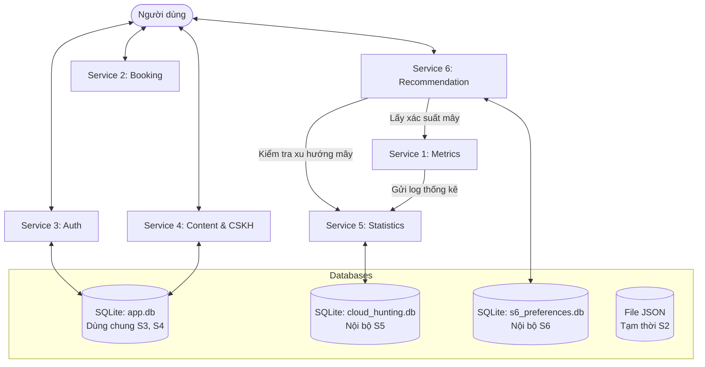

# 🌥️ HỆ THỐNG SĂN MÂY (CLOUD HUNTING PLATFORM) - TỔNG QUAN DỰ ÁN

Tài liệu này cung cấp cái nhìn tổng quan toàn diện về kiến trúc, chức năng, thiết kế cơ sở dữ liệu, các luồng tương tác và hướng dẫn vận hành cho toàn bộ dự án Săn Mây (Cloud Hunting). Tài liệu được chuẩn bị dành riêng cho Nguyên để nắm bắt nhanh tiến trình phát triển và tích hợp hệ thống.

---

## 📌 1. Giới thiệu chung
Săn mây (ngắm biển mây lúc bình minh) là một hoạt động du lịch vô cùng phổ biến tại các vùng cao như Đà Lạt, Tà Xùa, Y Tý. Tuy nhiên, hiện tượng biển mây phụ thuộc rất nhiều vào các điều kiện khí tượng phức tạp (nhiệt độ, độ ẩm, hướng gió, áp suất khí quyển, lớp nghịch nhiệt,...), khiến du khách thường xuyên gặp tình trạng "săn mây xịt".

**Hệ thống Săn Mây** được phát triển nhằm giải quyết triệt để bài toán này bằng cách:
*   Sử dụng mô hình học máy (AI) dự báo tỷ lệ có mây thực tế tại từng tọa độ.
*   Cá nhân hóa lịch trình di chuyển theo sở thích, phương tiện và khoảng cách của người dùng.
*   Cung cấp kịch bản dự phòng khẩn cấp **"Plan B" (Cứu nét)** khi thời tiết đột ngột thay đổi xấu trên đường đi nhằm đảm bảo an toàn và trải nghiệm tốt nhất.
*   Hỗ trợ dịch vụ đặt chỗ (Booking) homestay, quán cafe view mây gần điểm quan sát.
*   Hệ thống hóa tin tức du lịch, đánh giá dịch vụ và tiếp nhận phản hồi CSKH.

---

## 🏗️ 2. Kiến trúc tổng quan hệ thống (System Architecture)

Hệ thống được thiết kế theo kiến trúc **Microservices** hướng dịch vụ, giao tiếp qua giao thức HTTP RESTful API. Hệ thống bao gồm 6 dịch vụ độc lập (`Service 1` đến `Service 6`) và các module dùng chung:



### Thiết kế lưu trữ (Database Strategy)
*   **Cơ sở dữ liệu dùng chung (`app.db`)**: Phục vụ các dịch vụ có độ liên kết dữ liệu cao như `s3_auth` (User) và `s4_content` (Tickets, Posts, Reviews).
*   **Cơ sở dữ liệu độc lập**:
    *   `s5_statistics` sử dụng `cloud_hunting.db` để lưu trữ nhật ký dự đoán thời tiết.
    *   `s6_recommend` sử dụng `s6_preferences.db` lưu cấu hình sở thích người dùng và nhật ký thông báo cơ hội săn mây.
    *   `s2_booking` hiện tại lưu trữ cục bộ qua file Mock JSON (`mock_places.json`, `mock_bookings.json`) phục vụ giai đoạn phát triển ban đầu trước khi migrate lên DB thực tế ở các giai đoạn sau.

---

## 🛠️ 3. Chi tiết 6 Microservices

| Service | Tên thư mục | Port mặc định | Vai trò & Chức năng chính |
| :--- | :--- | :--- | :--- |
| **S1 — Metrics** | [s1_metrics](file:///d:/coder/OnlyC(ode)/IV/TDTT/Project/lastDance/CloudHuntting/src/s1_metrics) | `8001` | Dự báo thời tiết, chạy mô hình AI tính toán xác suất mây, gửi dữ liệu log về S5. |
| **S2 — Booking** | [s2_booking](file:///d:/coder/OnlyC(ode)/IV/TDTT/Project/lastDance/CloudHuntting/src/s2_booking) | `8002` | Quản lý thông tin địa điểm (cafe, homestay), kiểm tra slot trống và đặt chỗ gần điểm săn mây. |
| **S3 — Auth** | [s3_auth](file:///d:/coder/OnlyC(ode)/IV/TDTT/Project/lastDance/CloudHuntting/src/s3_auth) | `8003` | Đăng ký tài khoản, đăng nhập cấp JWT, phân quyền người dùng (User / Moderator / Admin). |
| **S4 — Content** | [s4_content](file:///d:/coder/OnlyC(ode)/IV/TDTT/Project/lastDance/CloudHuntting/src/s4_content) | `8004` (Route/Model) | Quản lý bài đăng (Blog/Tin tức), đánh giá chuyến đi (Reviews), và gửi yêu cầu trợ giúp hỗ trợ (CSKH Tickets). |
| **S5 — Statistics** | [s5_statistics](file:///d:/coder/OnlyC(ode)/IV/TDTT/Project/lastDance/CloudHuntting/src/s5_statistics) | `8005` | Thu thập dữ liệu log dự đoán của S1, tính trung bình theo ngày, xác định xu hướng mây tăng/giảm, tự động dọn log cũ. |
| **S6 — Recommend** | [s6_recommend](file:///d:/coder/OnlyC(ode)/IV/TDTT/Project/lastDance/CloudHuntting/src/s6_recommend) | `8006` | Lên lịch trình cá nhân hóa, xử lý kịch bản bẻ lái cứu nét Plan B, chạy tác vụ ngầm quét cơ hội săn mây và gửi thông báo. |

---

### 🌤️ Service 1: Metrics Service (`s1_metrics`)
Dịch vụ cung cấp chỉ số thời tiết tức thời tại tọa độ yêu cầu và chạy mô hình học máy để dự báo khả năng hình thành mây.

*   **Tính năng chính:**
    1.  **Lấy thông tin thời tiết:** Gọi sang API Open-Meteo để lấy các chỉ số khí tượng hiện tại.
    2.  **Tối ưu hóa chi phí API (Caching):** Tích hợp In-memory Cache (`cachetools` với TTL 60 phút) để tránh gọi trùng lặp API cho cùng một tọa độ trong khoảng thời gian ngắn.
    3.  **Cơ chế dự phòng (Fallback):** Nếu API thời tiết Open-Meteo gặp sự cố, dịch vụ sẽ tự động kích hoạt giá trị giả lập khí quyển chuẩn để đảm bảo hệ thống không bị gián đoạn.
    4.  **Dự báo mây qua AI:** Sử dụng mô hình `RandomForestClassifier` (Scikit-learn) đã được huấn luyện sẵn để tính toán xác suất (%) xuất hiện biển mây đẹp.
    5.  **Tương tác hệ thống:** Gửi log tự động sang Service 5 (`/api/s5/log`) sau mỗi lần dự đoán thành công.
*   **Mô hình AI & Dán nhãn dữ liệu tự động (Auto-labeling):**
    Quy trình tiền xử lý và huấn luyện nằm ở thư mục [models](file:///d:/coder/OnlyC(ode)/IV/TDTT/Project/lastDance/CloudHuntting/src/s1_metrics/models). Dữ liệu lịch sử 2 năm được dán nhãn tự động (`is_cloud_hunting_good = 1`) dựa trên các tiêu chí khí tượng học nghiêm ngặt:
    *   Độ ẩm tương đối (`relative_humidity_2m`) $\ge 92\%$ (không khí gần bão hòa).
    *   Độ chênh lệch nhiệt độ và điểm sương (`spread`) $\le 1.5^\circ\text{C}$ (dễ ngưng tụ mây tầng thấp).
    *   Tốc độ gió (`wind_speed_10m`) từ $1.0$ đến $8.0\text{ km/h}$ (gió nhẹ giúp mây cuộn sóng, gió quá mạnh sẽ phá vỡ lớp nghịch nhiệt gây tan mây).
    *   Độ che phủ mây tầng thấp (`cloud_cover_low`) $\ge 70\%$ (đảm bảo tạo thành một lớp biển mây liên tục).
    *   Độ che phủ mây tầng cao (`cloud_cover_high`) $\le 30\%$ (tránh che khuất ánh sáng mặt trời lúc bình minh để tạo hiệu ứng mây nhuộm hồng/vàng).
    *   Áp suất khí quyển (`pressure_msl`) $\ge 1012\text{ hPa}$ (điều kiện khí quyển ổn định, giữ nguyên lớp nghịch nhiệt).
*   **API chính:**
    *   `POST /api/s1/predict`: Nhận tọa độ GPS và tên địa điểm, trả về tỷ lệ phần trăm có mây, lời khuyên săn mây tương ứng và dữ liệu thời tiết chi tiết.

---

### 🏨 Service 2: Booking Service (`s2_booking`)
Dịch vụ hỗ trợ người dùng tìm kiếm homestay, điểm cắm trại hoặc quán cafe gần vị trí săn mây để nghỉ ngơi hoặc đặt chỗ trước.

*   **Tính năng chính:**
    1.  **Tìm kiếm địa điểm lân cận:** Tìm kiếm địa điểm dựa trên tọa độ GPS, bán kính quét, danh mục (cafe, hotel, camping,...), mức giá và các dịch vụ đi kèm (wifi, chỗ đỗ xe,...).
    2.  **Thuật toán chấm điểm tổng hợp (Composite Score):** Sắp xếp địa điểm ưu tiên dựa trên trọng số: **$60\%$ khoảng cách gần nhất** + **$40\%$ điểm đánh giá (rating) cao nhất**.
    3.  **Cơ chế chống trùng lặp (Idempotency Key):** Khi client gửi yêu cầu đặt chỗ kèm `Idempotency-Key` (UUID), hệ thống sẽ lưu vết. Nếu gặp lỗi kết nối và client thực hiện retry với cùng Key, hệ thống sẽ trả về thông tin đặt chỗ cũ thay vì tạo một bản ghi mới trùng lặp.
    4.  **Hủy đặt chỗ linh hoạt:** Cho phép người dùng hủy đặt chỗ kèm lý do, áp dụng điều kiện thời gian hủy tối thiểu (mặc định trước 2 tiếng).
*   **Mô hình dữ liệu:** Xem chi tiết định nghĩa dataclass tại [models.py](file:///d:/coder/OnlyC(ode)/IV/TDTT/Project/lastDance/CloudHuntting/src/s2_booking/models.py).
*   **API chính:**
    *   `GET /api/v1/places/nearby`: Tìm kiếm và phân trang các điểm xung quanh vị trí săn mây.
    *   `GET /api/v1/places/{place_id}/availability`: Kiểm tra các khung giờ trống còn lại trong ngày của địa điểm.
    *   `POST /api/v1/bookings`: Tạo yêu cầu đặt chỗ (yêu cầu header `Idempotency-Key`).
    *   `PATCH /api/v1/bookings/{booking_id}/cancel`: Thực hiện hủy đặt chỗ.

---

### 🔑 Service 3: Auth Service (`s3_auth`)
Chịu trách nhiệm quản lý định danh người dùng và bảo mật hệ thống.

*   **Tính năng chính:**
    1.  **Đăng ký & Đăng nhập:** Quản lý mật khẩu an toàn bằng thuật toán băm `bcrypt`, cung cấp mã khóa truy cập dưới dạng JWT Token.
    2.  **Phân quyền (RBAC):** Định nghĩa 3 vai trò chính: `user` (người dùng phổ thông), `moderator` (đối tác quản lý địa điểm/review), và `admin` (quản trị viên hệ thống).
    3.  **Hỗ trợ Tích hợp & Kiểm thử (Mock Mode):** Service 2 tích hợp một cơ chế cho phép nhà phát triển bỏ qua xác thực thực tế từ Service 3 khi cấu hình `MOCK_AUTH=true`. Hệ thống cung cấp sẵn các Token thử nghiệm nhanh:
        *   `dev-token-user`: Tài khoản vai trò `user` (User ID: 1)
        *   `dev-token-partner`: Tài khoản vai trò `moderator` (User ID: 100)
        *   `dev-token-admin`: Tài khoản vai trò `admin` (User ID: 999)
*   **API chính:**
    *   `POST /auth/register`: Đăng ký tài khoản người dùng mới.
    *   `POST /auth/login`: Xác thực thông tin đăng nhập và trả về mã JWT.

---

### 📝 Service 4: Content Service (`s4_content`)
Dịch vụ quản lý các nội dung tương tác cộng đồng và hỗ trợ khách hàng.

*   **Tính năng chính:**
    1.  **Quản lý hỗ trợ (Support Tickets):** Cho phép người dùng gửi các ticket yêu cầu trợ giúp trực tiếp tới CSKH khi gặp sự cố trên chuyến đi. Hỗ trợ cập nhật trạng thái xử lý ticket (`open`, `in_progress`, `resolved`, `closed`).
    2.  **Bài viết & Blog (News Posts):** Nơi ban biên tập hoặc người dùng đăng tải chia sẻ kinh nghiệm, hướng dẫn săn mây.
    3.  **Đánh giá & Review:** Người dùng thực hiện chấm điểm đánh giá (1-5 sao) kèm bình luận cho các tour hoặc địa điểm dịch vụ.
*   **API chính:**
    *   `POST/GET /content/tickets`: Tạo và hiển thị các yêu cầu trợ giúp.
    *   `POST/GET /content/posts`: Tạo bài viết mới và hiển thị danh sách bài viết đã xuất bản.
    *   `POST/GET /content/reviews`: Đăng tải và lấy danh sách đánh giá từ cộng đồng.

---

### 📊 Service 5: Statistics Service (`s5_statistics`)
Dịch vụ tổng hợp dữ liệu thời tiết lịch sử và phân tích xu hướng biến động mây phục vụ việc cải thiện chất lượng dự đoán.

*   **Tính năng chính:**
    1.  **Thu thập dữ liệu nội bộ:** Tiếp nhận dữ liệu log tự động được gửi từ Service 1 (`s1_metrics`) sau mỗi lượt dự báo thời tiết thành công.
    2.  **Tính toán thống kê:** Sử dụng thư viện `Pandas` để gộp dữ liệu theo ngày và tính toán xác suất săn mây trung bình cho từng địa điểm.
    3.  **Xác định xu hướng (Trend Analysis):** So sánh xác suất trung bình của ngày hiện tại với ngày trước đó để đưa ra trạng thái xu hướng mây: **Tăng** (tăng > 5%), **Giảm** (giảm > 5%), hoặc **Đi ngang**.
    4.  **Tác vụ dọn dẹp ngầm (Cleanup Job):** Chạy scheduler tự động ngầm mỗi 24 tiếng (thông qua `APScheduler`) để tìm kiếm và xóa bỏ các log cũ hơn 30 ngày nhằm tối ưu dung lượng đĩa cứng.
*   **API chính:**
    *   `POST /api/s5/log`: Ghi nhận dữ liệu dự đoán thời tiết mới từ S1.
    *   `GET /api/s5/statistics`: Trả về mảng dữ liệu thống kê trung bình theo ngày và xu hướng biến động của địa điểm trong khoảng thời gian được chỉ định (tối đa 30 ngày).

---

### 🧭 Service 6: Recommendation & Itinerary Planning Service (`s6_recommend`)
Đây là microservice điều phối chính, kết nối các dữ liệu từ các service khác để cung cấp trải nghiệm trọn vẹn cho du khách.

*   **Tính năng chính:**
    1.  **Địa chỉ hóa bản đồ (Geocoding):** Sử dụng Nominatim API của OpenStreetMap để phân tích chuỗi văn bản địa chỉ người dùng nhập thành tọa độ GPS chính xác. Nếu lỗi hoặc không tìm thấy, hệ thống tự động đưa về tọa độ mặc định là Chợ Đà Lạt.
    2.  **Tuyến đường bộ thực tế (OSRM Routing):** Không sử dụng khoảng cách đường chim bay đơn thuần, S6 tích hợp OSRM API để tính toán quãng đường bộ di chuyển (km) và thời gian di chuyển dự kiến (phút). Nếu API OSRM lỗi, hệ thống tự động fallback sang tính toán khoảng cách haversine với vận tốc giả định trung bình $30\text{ km/h}$.
    3.  **Chấm điểm địa điểm săn mây tốt nhất:**
        *   *Bộ lọc cứng (Hard Filters):* Loại bỏ các điểm nằm ngoài bán kính tối đa người dùng thiết lập, loại bỏ các điểm không hỗ trợ đường đi ô tô nếu phương tiện di chuyển là ô tô.
        *   *Chấm điểm thích nghi (Soft Scoring):* Điểm cơ sở lấy từ tỷ lệ mây của S1 $\rightarrow$ cộng/trừ 10 điểm dựa trên xu hướng từ S5 $\rightarrow$ cộng/trừ 20 điểm tùy thuộc vào mức độ tương thích về phong cách du lịch (phượt, sống ảo) và không khí (hoang sơ, thương mại).
    4.  **Lập lịch trình chi tiết (Itinerary Generator):** Xây dựng thời gian biểu chi tiết từ lúc khởi hành, gợi ý điểm dừng chân/quán cafe view mây trên đường đi, thời gian mặt trời mọc (bình minh) và khung giờ vàng chụp ảnh đẹp nhất.
    5.  **Bẻ lái khẩn cấp "Plan B":**
        *   Khi người dùng đang đi nhưng thời tiết tại điểm đích đột ngột chuyển biến xấu (xác suất mây giảm dưới $60\%$), hệ thống sẽ tự động quét các điểm lân cận.
        *   **Khoảng cách phạt (Distance Penalty):** Để đảm bảo người dùng không phải đi quá xa, hệ thống sẽ trừ bớt 3 điểm cho mỗi $1\text{ km}$ khoảng cách từ vị trí hiện tại đến điểm săn mây thay thế.
        *   **Dừng chân an toàn:** Nếu điểm thay thế tốt nhất nằm quá xa (bán kính $>15\text{ km}$), hệ thống sẽ đề xuất lộ trình dừng chân khẩn cấp tại quán cafe hoặc homestay gần nhất để đảm bảo an toàn thay vì cố gắng di chuyển tiếp.
    6.  **Tác vụ quét cơ hội ngầm (Background Job):** Chạy scheduler định kỳ mỗi 1 phút để cập nhật tỷ lệ mây của toàn bộ địa điểm. Nếu phát hiện địa điểm có tỷ lệ mây đạt ngưỡng vàng $\ge 85\%$, hệ thống tự động ghi nhận cảnh báo cơ hội săn mây mới vào News Feed. Hệ thống áp dụng **cooldown chống spam trong vòng 12 tiếng** cho mỗi địa điểm.
*   **API chính:**
    *   `POST /api/s6/recommend`: Nhận thông tin sở thích người dùng và vị trí xuất phát, trả về lịch trình di chuyển chi tiết và top 3 địa điểm tốt nhất.
    *   `POST /api/s6/plan-b`: Yêu cầu chuyển hướng khẩn cấp khi gặp thời tiết xấu.
    *   `GET /api/s6/notifications`: Lấy danh sách các cảnh báo cơ hội săn mây mới nhất (News feed).

---

## 📈 4. Luồng xử lý chính trong hệ thống (Main Workflows)

### Luồng 1: Lên lịch trình săn mây ban đầu (Recommendation Flow)
```
[Client App]             [S6 Recommendation]            [S1 Metrics]            [S5 Statistics]
     |                            |                          |                         |
     |--- 1. POST /recommend ---->|                          |                         |
     |                            |--- 2. Lấy thời tiết AI ->|                         |
     |                            |                           |--- 3. Lấy thời tiết -->| [Open-Meteo]
     |                            |<-- 4. Trả xác suất mây ---|                        |
     |                            |                          |                         |
     |                            |--- 5. Kiểm tra xu hướng -------------------------->|
     |                            |<-- 6. Trả xu hướng mây ----------------------------|
     |                            |                          |                         |
     |                            |-- 7. Tính Composite Score|                         |
     |                            |-- 8. Lên Itinerary & Time|                         |
     |<-- 9. Trả về lịch trình ---|                          |                         |
```

### Luồng 2: Cảnh báo tự động cơ hội săn mây (Background Scan Flow)
```
 [APScheduler (S6)]           [S1 Metrics]               [Database S6]
         |                         |                          |
         |--- 1. Quét định kỳ ---->|                          |
         |    (Mỗi 1 phút)         |                          |
         |                         |--- 2. Lấy thời tiết ---->| [Open-Meteo]
         |                         |<-- 3. Trả xác suất ------|
         |<-- 4. Trả tỷ lệ mây ----|                          |
         |                         |                          |
         |--- 5. Tỷ lệ >= 85%? --->|                          |
         |    (Check cooldown 12h) |-- 6. Ghi nhận cảnh báo ->|
```

---

## 📂 5. Cấu trúc mã nguồn chi tiết
Hệ thống được cấu trúc rõ ràng trong thư mục `src` để dễ dàng bảo trì và mở rộng:

```text
CloudHuntting/
├── src/
│   ├── s1_metrics/            # Service 1: Dự báo thời tiết & Mô hình AI
│   │   ├── models/            # Pipeline chuẩn bị dữ liệu và script train model
│   │   ├── main.py            # Điểm khởi chạy Service 1 (FastAPI)
│   │   ├── routes.py          # Khai báo các endpoints
│   │   ├── ai_service.py      # Logic load model và chạy dự đoán AI
│   │   └── weather_service.py # Gọi Open-Meteo API, xử lý Cache & Fallback
│   │
│   ├── s2_booking/            # Service 2: Đặt chỗ nghỉ ngơi lân cận
│   │   ├── data/              # Lưu trữ dữ liệu Mock JSON địa điểm và đặt chỗ
│   │   ├── main.py            # Điểm khởi chạy Service 2
│   │   ├── routes.py          # API endpoints đặt chỗ
│   │   ├── services.py        # Xử lý logic đặt chỗ & composite score
│   │   ├── dependencies.py    # Xử lý phân giải Token & Mock Token
│   │   └── models.py          # Định nghĩa cấu trúc Dataclass Place & Booking
│   │
│   ├── s3_auth/               # Service 3: Đăng ký, đăng nhập & phân quyền JWT
│   │   ├── main.py            # Khởi động dịch vụ xác thực
│   │   ├── routes.py          # API Endpoints (/register, /login)
│   │   ├── auth.py            # Hàm mã hóa mật khẩu và tạo JWT token
│   │   └── models.py          # Model SQLite lưu trữ Users
│   │
│   ├── s4_content/            # Service 4: Quản lý bài đăng, reviews và hỗ trợ
│   │   ├── routes.py          # API Endpoints quản lý nội dung
│   │   ├── models.py          # Model lưu trữ Tickets, Posts, Reviews
│   │   └── schemas.py         # Định nghĩa cấu trúc Pydantic validate dữ liệu
│   │
│   ├── s5_statistics/         # Service 5: Thống kê dữ liệu & xu hướng mây
│   │   ├── main.py            # Khởi động dịch vụ, kích hoạt APScheduler cleanup
│   │   ├── routes.py          # Endpoints lấy thống kê và ghi log
│   │   ├── services.py        # Gom nhóm dữ liệu qua Pandas, xử lý xu hướng
│   │   └── database.py        # Khởi tạo DB nội bộ 'cloud_hunting.db'
│   │
│   ├── s6_recommend/          # Service 6: Cá nhân hóa lịch trình & Plan B
│   │   ├── main.py            # Khởi động dịch vụ, kích hoạt APScheduler scan mây
│   │   ├── routes.py          # Endpoints gợi ý lịch trình, Plan B và thông báo
│   │   ├── services.py        # Logic Geocoding, OSRM Routing, Plan B, scoring
│   │   ├── database.py        # Khởi tạo DB 's6_preferences.db'
│   │   └── integrations.py    # Giao tiếp gọi API sang S1 và S5
│   │
│   ├── shared/                # Thư viện dùng chung
│   │   └── database.py        # Cấu hình SQLAlchemy kết nối SQLite dùng chung (app.db)
│   │
│   └── utils/                 # Các hàm tiện ích dùng chung
│
├── requirements.txt           # Danh sách các thư viện phụ thuộc của dự án
└── app.db                     # Cơ sở dữ liệu SQLite dùng chung (tự động sinh)
```

---

## 🚀 6. Hướng dẫn khởi chạy hệ thống (Running Guide)

> [!IMPORTANT]
> Cần đảm bảo Python phiên bản `3.10` trở lên đã được cài đặt và kích hoạt môi trường ảo.

### Bước 1: Khởi tạo môi trường ảo và cài đặt thư viện
Chạy các câu lệnh sau từ thư mục gốc của dự án:
```powershell
# Kích hoạt môi trường ảo (Windows)
.\venv\Scripts\activate

# Cài đặt toàn bộ thư viện phụ thuộc
pip install -r requirements.txt
```

### Bước 2: Chạy các dịch vụ độc lập
Mở các tab terminal riêng biệt để chạy các lệnh khởi chạy dưới đây:

*   **Chạy Service 1 (Metrics) — Port 8001**
    ```bash
    python src/s1_metrics/main.py
    ```
*   **Chạy Service 2 (Booking) — Port 8002**
    ```bash
    uvicorn src.s2_booking.main:app --reload --port 8002
    ```
*   **Chạy Service 3 (Auth) — Port 8003**
    ```bash
    python src/s3_auth/main.py
    ```
*   **Chạy Service 5 (Statistics) — Port 8005**
    ```bash
    python src/s5_statistics/main.py
    ```
*   **Chạy Service 6 (Recommend) — Port 8006**
    ```bash
    python src/s6_recommend/main.py
    ```

> [!TIP]
> *   Dịch vụ S4 (`s4_content`) được tích hợp thông qua routes và models, sử dụng chung cơ sở dữ liệu `app.db` và có thể được chạy kết hợp hoặc khởi tạo cổng chạy riêng tương tự như Service 3.
> *   Sau khi chạy, truy cập đường dẫn Swagger UI của mỗi dịch vụ tại: `http://127.0.0.1:<PORT>/docs` để kiểm tra và gọi thử API trực quan.
